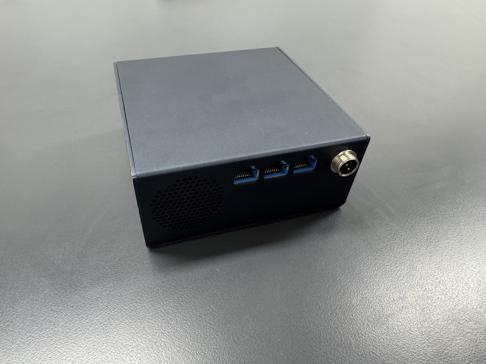
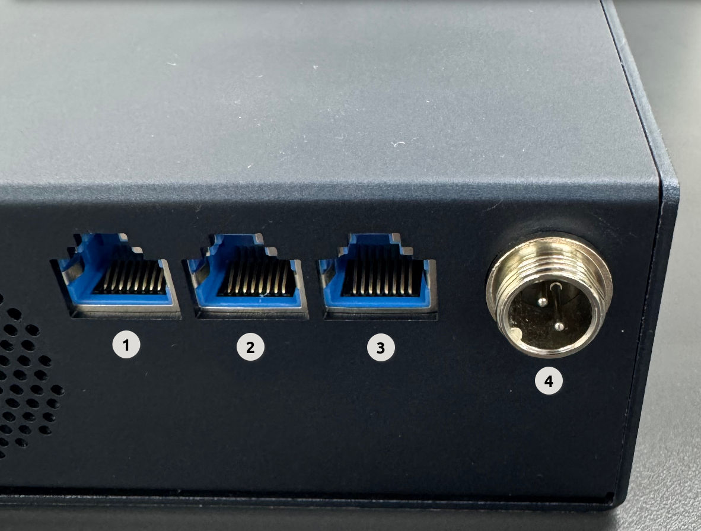
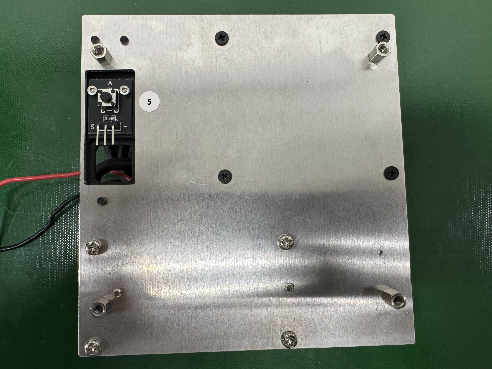
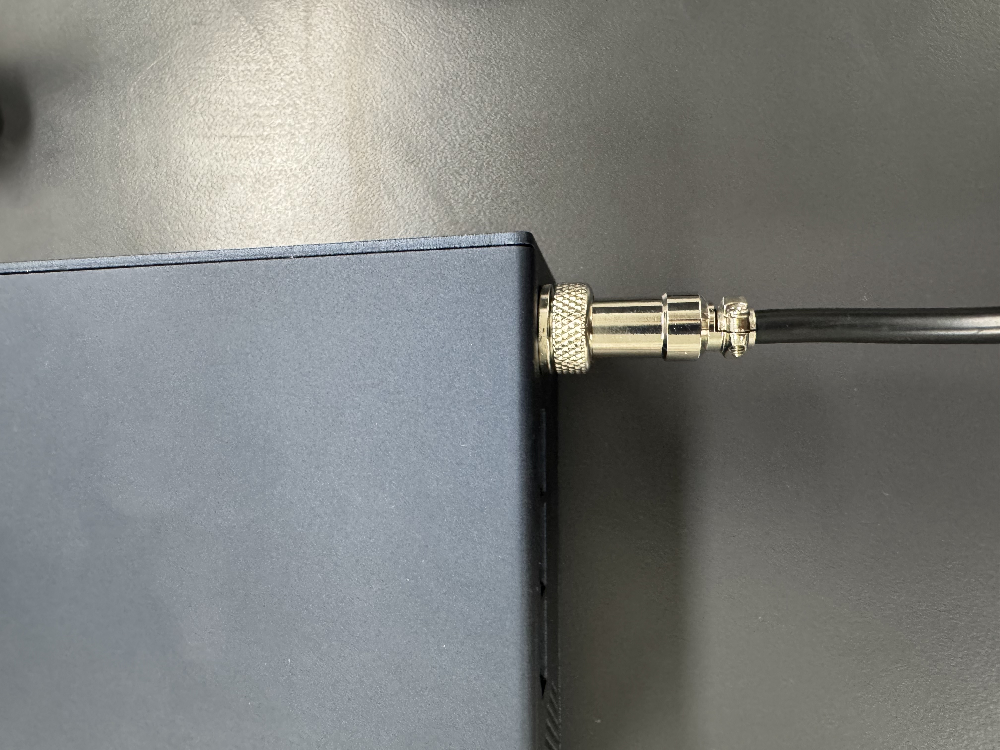
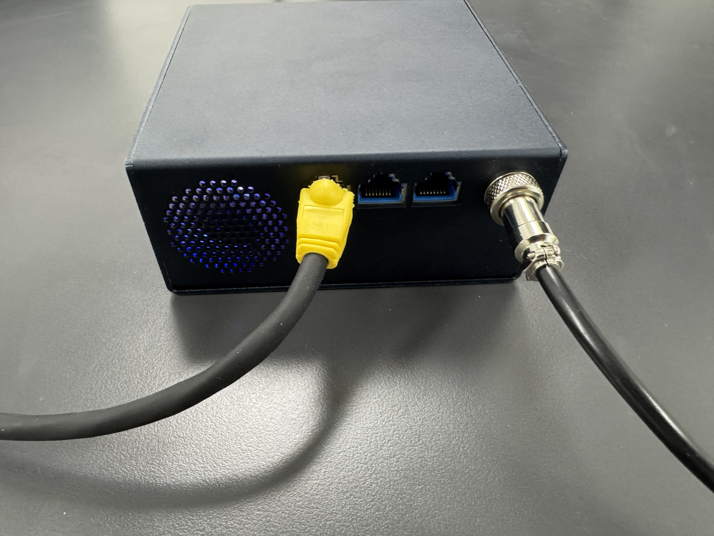
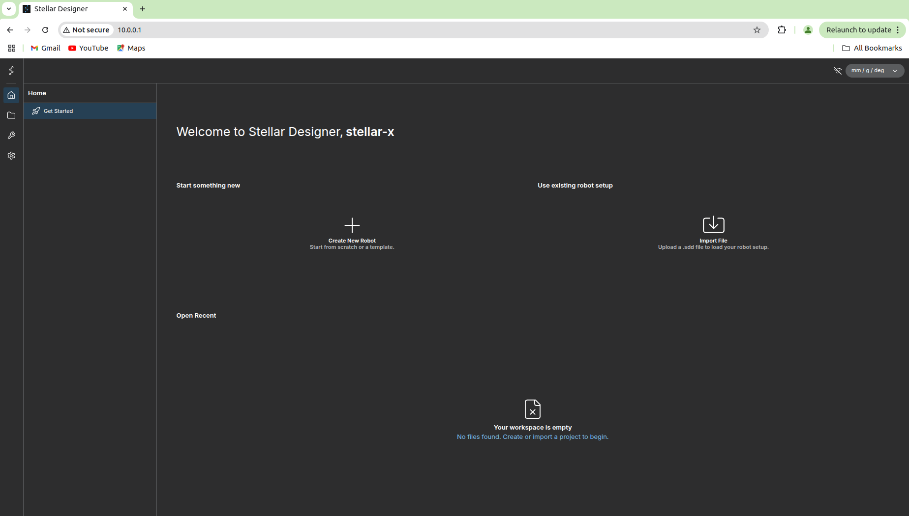

# Getting Started with StellarX

Welcome to the StellarX family! We’re excited to have you on board. This guide will walk you through everything you need to get up and running—from unboxing and hardware assembly to establishing your first network connection with your PC.

---

## 1. What's in the Box
Before we begin, please check that your package includes all the following components. If anything is missing, please contact our support team.

<figure markdown="span">
  { width="750" }
  <figcaption>StellarX Main Unit</figcaption>
</figure>

<figure markdown="span">
  { width="500" }
  <figcaption>24V Power Adapter</figcaption>
</figure>

<figure markdown="span">
  { width="500" }
  <figcaption>Power Cable</figcaption>
</figure>

---

## 2. Device Overview
Take a moment to familiarize yourself with the StellarX interface. Knowing the ports now will make the setup process much smoother.

<figure markdown="span">
  { width="500" }
  <figcaption>StellarX Interface1</figcaption>
</figure>

<figure markdown="span">
  { width="500" }
  <figcaption>StellarX Interface2</figcaption>
</figure>

| Port / Button | Description |
| :--- | :--- |
| **1. Eth1 (Static IP)** | Pre-configured with a **Static IP** for direct connection. • IP: `10.0.0.1` • Subnet Mask: `255.255.255.0` |
| **2. Eth2 (DHCP)** | Configured for **DHCP**. Connect this to a router or switch to receive an IP address automatically. |
| **3. EtherCAT Out** | EtherCAT Master output. Connect this to the **IN** port of your first EtherCAT slave device. |
| **4. DC 24V In** | Power input port. |
| **5. Reset Button** | Used to restore the device to factory settings. |

---

## 3. Hardware Setup & Power On
To ensure the longevity of your device and prevent electrical damage, please follow these steps in order.

1. **Prepare the Adapter:** Connect the power cable to the 24V power adapter. **Stop! Do not plug it into the wall outlet just yet.**

2. **Connect to StellarX:** Insert the adapter's output cable into the **DC 24V In** port on the unit.

    !!! error "To prevent **electrical arcing (sparks)** or connection issues, always connect the cable to the **StellarX unit first**, and *then* plug the power adapter into the wall."

    !!! info "The connector features a small guide notch inside. If it doesn't slide in easily, **gently rotate the cable** until the notch aligns with the port."

    <figure markdown="span">
      { width="500" }
      <figcaption>Aligning the connector notch</figcaption>
    </figure>

3. **Secure the Connection:** Once fully inserted, hand-tighten the metal nut on the connector to ensure it stays securely locked in place.

    <figure markdown="span">
      { width="500" }
      <figcaption>Securing the locking nut</figcaption>
    </figure>

4. **Power Up:** Finally, plug the power cable into a standard wall outlet. Your StellarX will power on automatically.

---

## 4. Network Configuration
To talk to StellarX, your PC needs to be on the same "wavelength" (network subnet).

1. **Physical Connection:** Connect an Ethernet (LAN) cable to **Eth1 (Port 1)** on the StellarX unit and the other end to your PC’s LAN port.

    <figure markdown="span">
      { width="500" }
      <figcaption>Connecting to Eth1</figcaption>
    </figure>

2. **Configure Your PC:**
   Since StellarX's Eth1 is fixed at `10.0.0.1`, you must set your PC to a static IP in the same range (e.g., `10.0.0.2`).

    !!! warning "Avoid using `10.0.0.1` for your PC, as this will cause an IP conflict."

    * **For Ubuntu Users:**
        1. Go to **Settings > Network**.
        2. Click the **gear icon** next to your wired connection.
        3. Select the **IPv4** tab and choose **Manual**.
        4. Set Address: `10.0.0.2` / Netmask: `255.255.255.0`.
    
    * **For Windows Users:**
        1. Go to **Settings > Network & Internet > Ethernet**.
        2. Find **IP assignment** and click **Edit**.
        3. Select **Manual**, toggle **IPv4 On**, and enter:
           - IP address: `10.0.0.2`
           - Subnet mask: `255.255.255.0`

3. **Verify the Connection:**
   Open your preferred web browser (Chrome, Edge, etc.) and type the following into the address bar:
   `http://10.0.0.1`

4. **Success!**
   If the **Stellar Designer** welcome screen appears, you are officially ready to start your project!

    <figure markdown="span">
      { width="800" }
      <figcaption>Stellar Designer Welcome Screen</figcaption>
    </figure>

---

## 5. Hardware Factory Reset
If you ever forget your IP settings or need a fresh start, you can perform a factory reset.

<figure markdown="span">
    { width="500" }
    <figcaption>Reset Button Location</figcaption>
</figure>

### **The Procedure**
1. Locate the **Reset Button** on the bottom of the unit.
2. Press and hold the button for **more than 3 seconds**.
3. The system will automatically reboot.
4. Once back up, **Eth1** will be restored to the default IP: `10.0.0.1`.

### **Troubleshooting**

If the reset doesn't seem to trigger, try these steps:

1. **Power Cycle:** Unplug the power, wait 10 seconds, and plug it back in.
2. **Wait & Retry:** Give the system about **1 minute** to fully initialize, then try holding the reset button for 3 seconds again.

!!! error "A factory reset will **permanently erase all stored data**, including projects, scripts, and custom settings. Please use this feature with caution."
