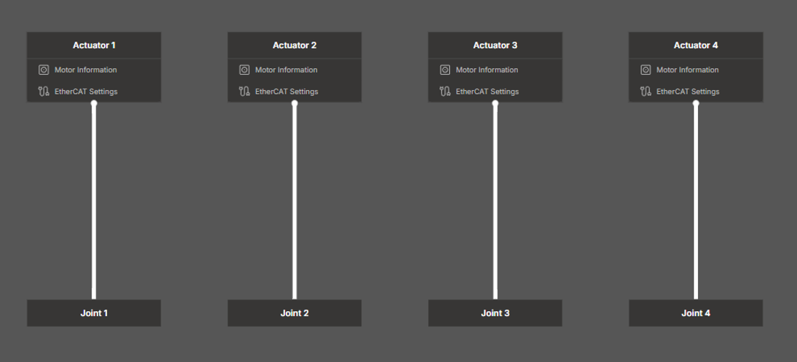
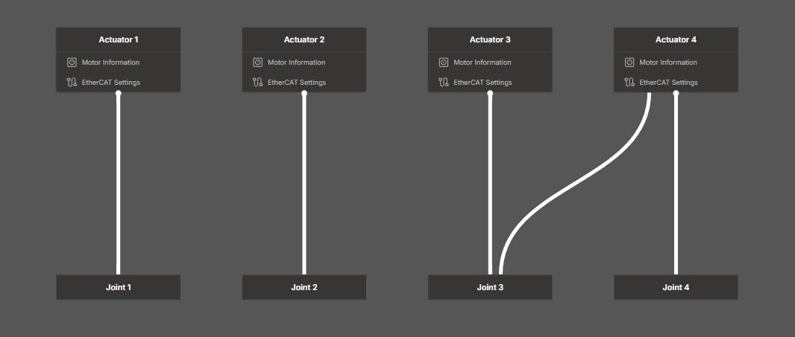

# User Guide: Actuator Mapping & Configuration Details

This guide provides a detailed explanation of the Actuator Mapping process, including EtherCAT protocols, transmission theory, and parameter definitions.

## 1. Motor Information
This section defines the physical characteristics of the motor hardware.

* **Source:** Values must be taken directly from the manufacturer's **Specification Sheet**.
* **Scope:** Enter only the raw motor data here. Gear reducers and transmission elements are configured in a separate "Transmission" step to ensure accurate dynamics modeling.

## 2. EtherCAT Settings (Advanced)
EtherCAT settings define how the controller communicates with the servo driver. Incorrect settings here can lead to initialization failures or erratic motion.

### A. SDO Settings (Initialization Parameters)
SDOs (Service Data Objects) are used for non-real-time configuration, typically during the startup phase.

* **Absolute Encoder Object:**
    This object is used to clear absolute encoder errors (e.g., after battery replacement). **The method of resetting varies by drive architecture.**

    1.  **Atomic Execution Model (Supported via SDO):**
        * **Description:** Standard drives allow the encoder to be reset by writing a single value (e.g., `1`) to a designated SDO Index.
        * **Action:** Enter the register address here. The system will automatically trigger the reset during initialization.

    2.  **Transactional Execution Model (Requires Direct Connection):**
        * **Description:** High-performance drives (e.g., **Synapticon SOMANET**) use a safety handshake protocol (Request → Processing → Response) rather than a simple register write.
        * **Action:** **Leave the SDO Entry 1 field blank.** Connect directly to the servo drive using the manufacturer's tool to perform the reset.

### B. PDO Mapping (Real-time Data)
PDOs (Process Data Objects) handle periodic, high-speed data exchange.

* **RxPDO (Controller → Driver):** Must include `Control Word`, `Target Position`, `Target Torque`, `Torque Offset`, `Mode of Operation`.
* **TxPDO (Driver → Controller):** Must include `Status Word`, `Position Actual Value`, `Velocity Actual Value`, `Torque Actual Value`, `Mode of Operation Display`.

!!! warning "**Critical Warning: Verify PDO Mapping Indices**"
    Ensure you use **User-Defined Mapping** indices (e.g., `0x1600`/`0x1A00` for Synapticon). Using "Manufacturer Specific" or reserved areas will result in EtherCAT application errors.

## 3. Transmission System (Actuator-Joint Relationship)

The Position/Velocity commands issued to each **actuator** (motor) are converted through a **linear transformation** before reaching the robot link’s **ideal joint**.

### A. Overview & Terminology
* **1 : 1 Mapping:** Each actuator drives exactly one joint (e.g., Simple 2-Bar Robot).
* **n : 1 Composite Mapping:** Two or more actuators share one joint (e.g., SCARA Z-axis + Θ4, or Differential Wrists).


*Figure 1: 1:1 Mapping*


*Figure 2: Composite Mapping*

| Term | Meaning |
|------|---------|
| **Gear ratio** | Input-shaft angle / Output-shaft angle |
| **Edge Value** | Conversion coefficient *Actuator i → Joint j* |

### B. How to Calculate Edge Values

The controller computes the joint vector $q$ using the matrix $U$:

$$
q = U \cdot a
$$

*(Where $q$ is the joint vector and $a$ is the actuator vector)*

#### Case 1: 1 : 1 Mapping (Standard)

1. **Add an edge** connecting Actuator $i$ to Joint $i$.
2. **Enter the scale coefficient**:
    * **Gearbox:** $1 / \text{Gear Ratio}$
        * *Example:* 1 : 50 gearbox → `1.0 / 50.0 = 0.02`
    * **Ballscrew:** $\text{Lead} / (2 \pi)$
        * *Example:* Lead = 0.020 m → `0.02 / (2π) ≈ 0.0031831`
3. **Reverse Direction:** If the joint moves opposite to the command, flip the sign (e.g., `-0.02`).

#### Case 2: Composite Mapping (Differential)

For complex mechanisms where multiple motors drive a single axis (like a SCARA Z-axis/Theta combined), you must fill the **Upper-Triangular Matrix**.

**Example Matrix Form:**

```text
      ┌                                     ┐
      │ 0.02      0        0        0       │
U  =  │   0     0.02       0        0       │
      │   0       0     0.00254  0.000254   │
      │   0       0        0      0.1       │
      └                                     ┘
```

This implies:

* `q3` is affected by both `a3` and `a4` (Main lead + Secondary mechanical offset).
* `q4` is driven by `a4`.

### C. FAQ

* **Q. I have a two-stage gearbox. What do I enter?**
    * A. Multiply the two ratios to get the final ratio, then input `1 / (Final Ratio)`.

* **Q. I’m confused about the sign.**
    * A. If the joint moves opposite to the command, simply flip the edge’s sign to negative.