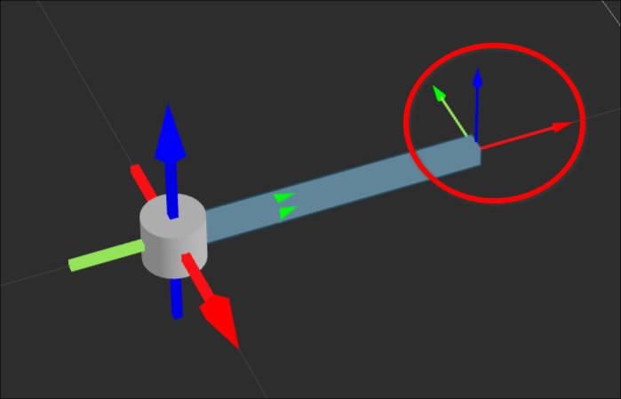
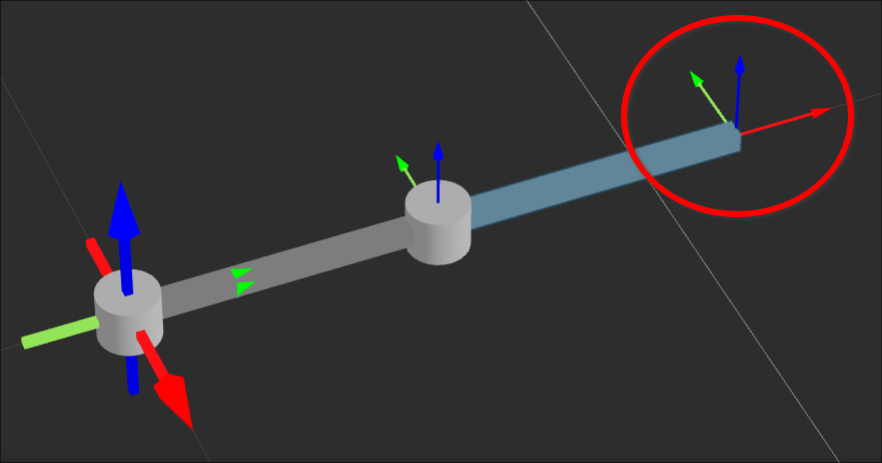
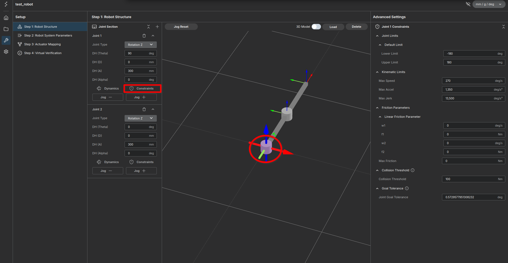
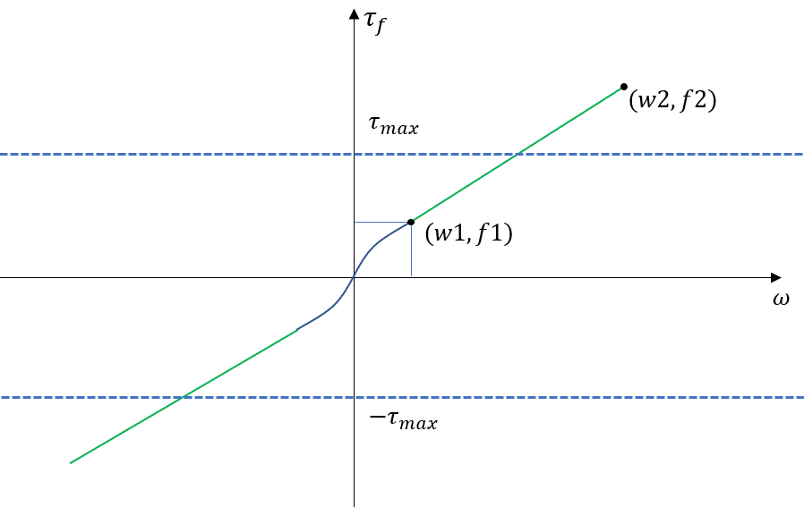

# User Guide: Robot Configuration Details

This guide provides in-depth explanations of the parameters and theories used in the Robot Creation tool. It is intended to supplement the basic Tutorial.

---

## 1. Dynamics Settings

When configuring **Dynamics**, you are defining the physical properties of the link connecting the *Current Joint Coordinate System* to the *Next Joint Coordinate System*.

### Understanding Coordinate Systems
To accurately configure dynamics, you must understand the **Output Coordinate System**. This refers to the coordinate system advanced by the DH parameters from the current joint.

* **Mass & Inertia Reference:** All physical properties (Center of Mass, Inertia Tensor) must be defined relative to this **Output Coordinate System**.

**Reference Diagrams:**
<figure markdown="span">
    
    <figcaption>Link 1 Output Coordinate System</figcaption>
</figure>

<figure markdown="span">
    
    <figcaption>Link 2 Output Coordinate System</figcaption>
</figure>

### Parameters Detail

#### 1. Mass
- Input the mass of the link physically connecting the current joint to the next.
- **Tip:** Derive this from your CAD model by measuring the mass between the output stage of the current joint and the output stage of the next.

#### 2. Center of Mass (CoM)
- **Reference Frame:** The Output Coordinate System (as shown above).
- **How to measure:** Define a coordinate system in your CAD software (e.g., SolidWorks) matching the Output Coordinate System and measure the CoM relative to it.

#### 3. Rotational Inertia
- **Reference Point:** The Center of Mass.
- **Orientation:** Must match the orientation of the Output Coordinate System.

---

## 2. Constraints & Safety

The **Constraints** section handles safety boundaries and physical limitations of the actuators.

<figure markdown="span">
    
    <figcaption>Constraints Configuration Panel</figcaption>
</figure>

### 1. Joint Limits
These are **software-defined hard stops**. If a target position is outside `[Lower Limit, Upper Limit]`, the controller will immediately halt operation to prevent mechanical damage.

### 2. Kinematic Limits
Defines the maximum motion capabilities.

* **Max Speed/Accel/Jerk:** Limits applied during motion generation.
* **Units:**
    * Revolute Joints: `deg`, `deg/s`, `deg/s²`
    * Prismatic Joints: `mm`, `mm/s`, `mm/s²`

!!! error "Always set these values based on your actuator's specifications (motor curve, gear ratio) to prevent overheating or damage."

### 3. Friction Parameters
This defines the joint friction model. The friction torque ($\tau_{friction}$) is calculated based on joint velocity ($w$).

**Friction Model Curve:**
<figure markdown="span">
    
    <figcaption>Friction Model Curve</figcaption>
</figure>

* **Smooth Transition (`-w1 < w < w1`):** The curve follows a quadratic function to avoid discontinuities at zero velocity.
* **Linear Region (`|w| > w1`):** The friction increases linearly.
* **Parameters:**
    * `w1`, `f1`: Low-speed threshold and corresponding friction.
    * `w2`, `f2`: High-speed threshold and corresponding friction.
    * `Max Friction`: The absolute upper limit of friction torque.

### 4. Collision Threshold
The sensitivity for collision detection.

* If **External Torque > Threshold**, the robot triggers a collision error and stops.
* Set this carefully: Too low causes false alarms during fast motion; too high makes the robot unsafe.

### 5. Goal Tolerance
Determines when a motion command is considered "finished."

* If `|Current Pos - Target Pos| <= Tolerance`, the action reports **Success**.