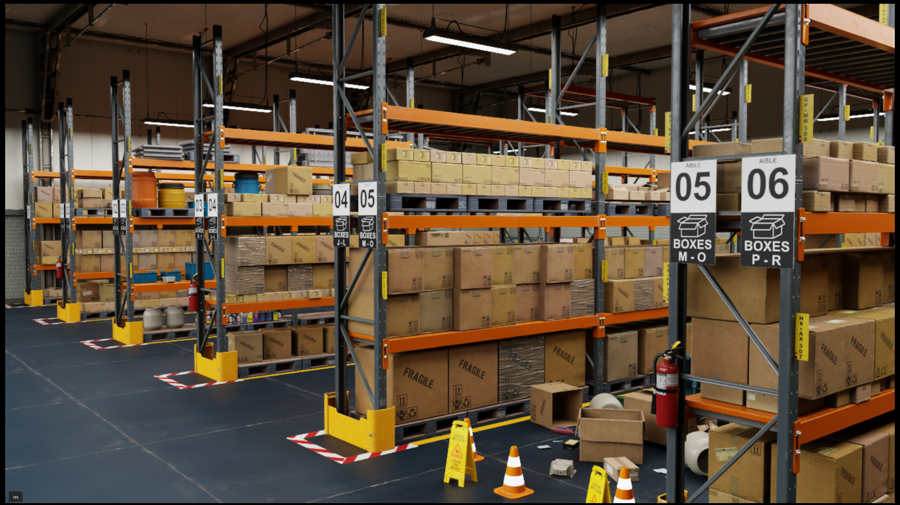

# Introduction

## Nvidia Isaac Sim

<figure markdown="span">
    
</figure>

[NVIDIA Isaac Sim](https://developer.nvidia.com/isaac/sim){:target="_blank"} is a robotics simulator for developers to build, simulate and test robots in physically-based virtual environments.
Users can use StellarX with Isaac Sim to design, plan and verify robot motions before deploying to the real world.

Install Isaac Sim by following the instructions from the link below.

[Isaac Sim Installation](https://docs.isaacsim.omniverse.nvidia.com/5.0.0/installation/index.html){:target="_blank"}

**This tutorial is based on Isaac Sim Version 5.0.0 and Ubuntu 22.04**

Once Isaac Sim is installed, follow [the next chapter](../extension_installation/index.md) to install the StellarX extension.
