# 3D Model Creation
In this chapter, we will assemble 3d model parts for visualization in Stellar X. In terms of applying to real workflow, we're going to assume that you finished your CAD design and have 3d model files for each links. If you are using manufactured robots, you should have your technical specification ready for DH-parameters, joint limits, physics property etc. This step is purely for visualization and optional, so you can skip it and have no problem moving forward. We'll be using 6-axis manipulator for this example. Please download 3d models from link below and unzip it.

- **[download link](models/example_manipulator_parts.zip)**

<figure markdown="span">
    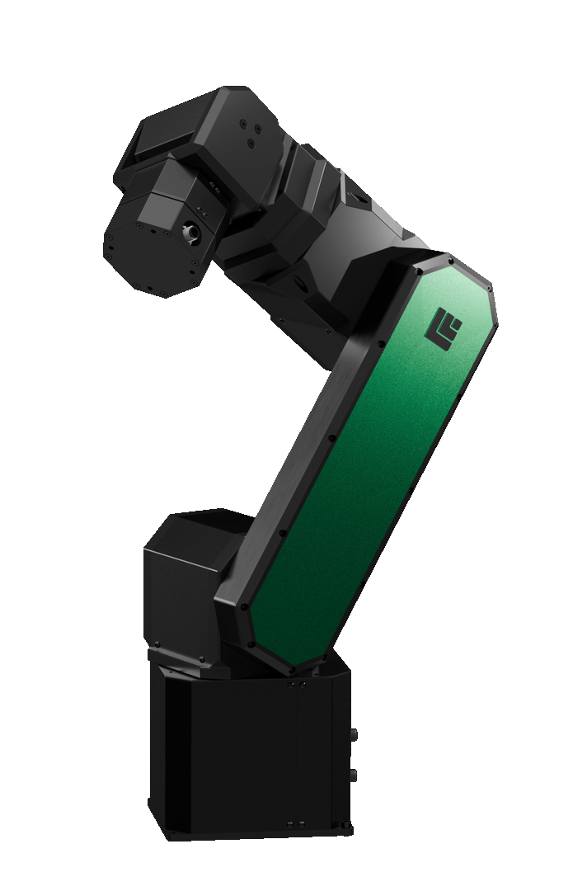{ width="400" }
    <figcaption>Rendered Image of Example Manipulator</figcaption>
</figure>

---

## 1. Basic Design Criteria
We'll be using blender for this step. Blender accepts most of major 3d model formats except some proprietary ones. You don't have to use blender, but the naming convention, model tree, output file format must be matched.

- [**Blender Installation**](https://www.blender.org/download/)

### 1. Blender Preferences
<figure markdown="span">
    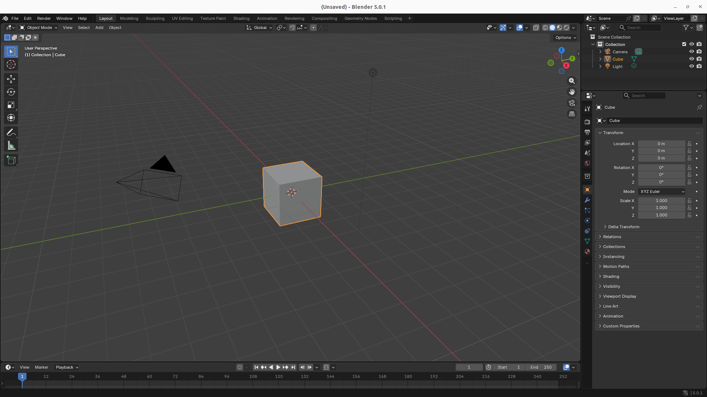{ width="1000" }
</figure>
- First, open blender and delete default `Camera`, `Cube` and `Light`.

### 2. Joint and Link Creation
#### 1. Naming Conventions

**Base**

| Classification | Name |
|------|------|
| Joint | J0 |
| Link | link0 |

**Joint**

- `J1` ~ `Jn`

**Link**

- `link1` ~ `linkn`
!!! info "`n` increases with the number of joints."

#### 2. Create Joints
<figure markdown="span">
    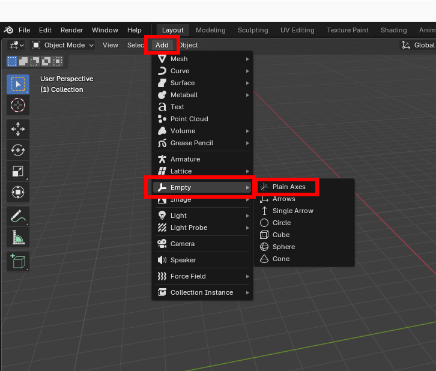
    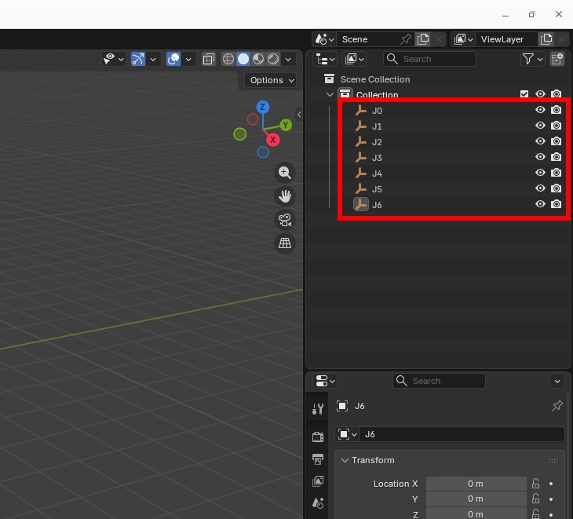
</figure>
- Click `Add` -> `Empty` -> `Plain Axes` to add axes. Add total of 7 axes and rename them to J0 ~ J7. These names act as joints in Designer and their name must be `J{number}`.

#### 3. Add links
<figure markdown="span">
    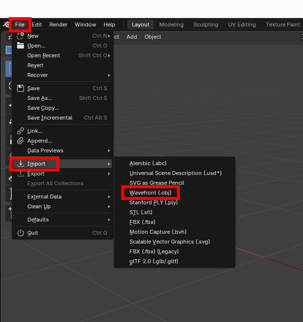
    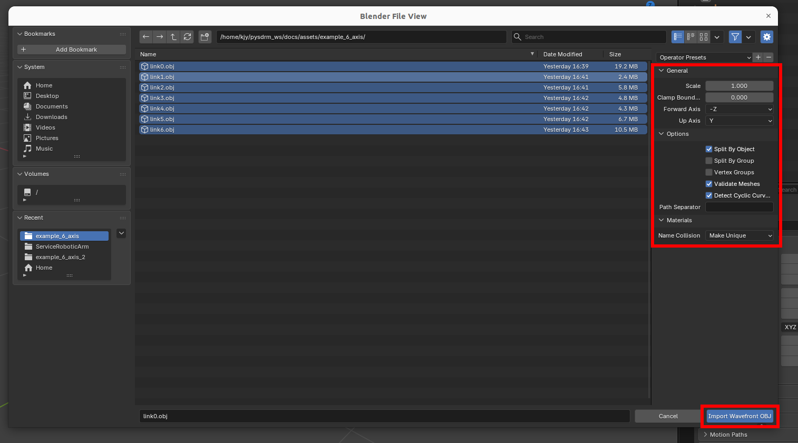{ width="1000" }
    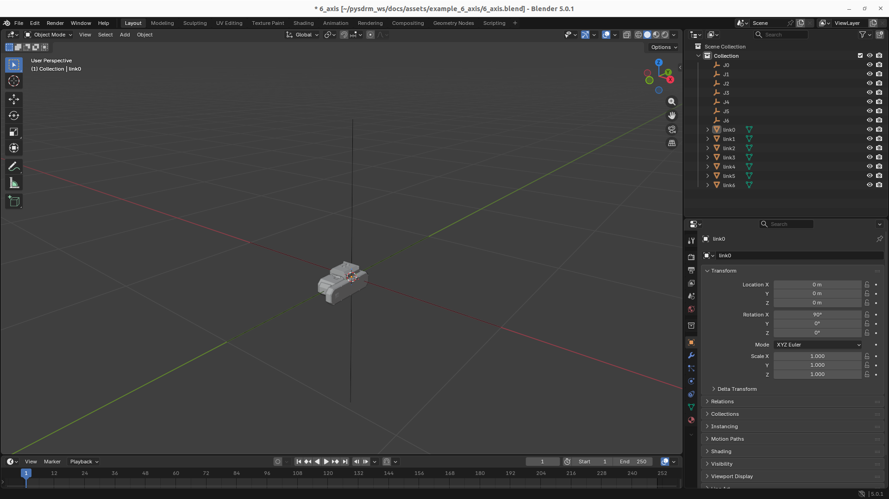{ width="1000" }
</figure>
- Now, we are going to add 3d models. Click `File` -> `Import` -> `Wavefront`. Go to saved directory and import all 7 of them. Be aware of import settings. If imported successfully, it should look like bottom picture.

<figure markdown="span">
    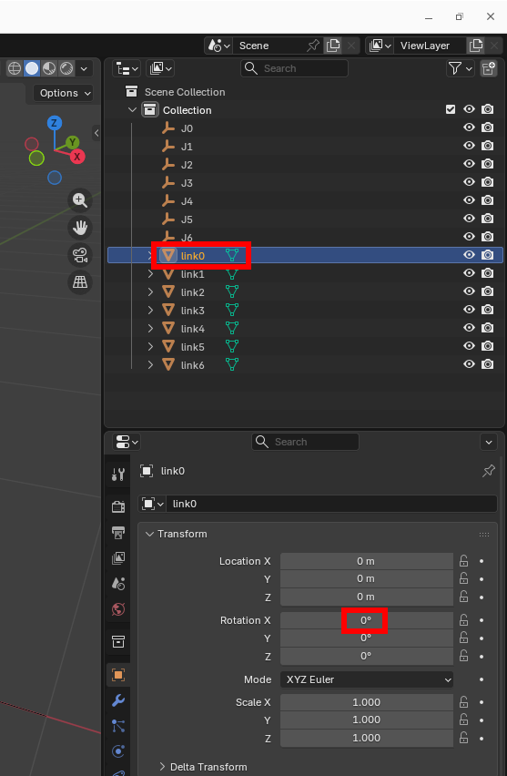
    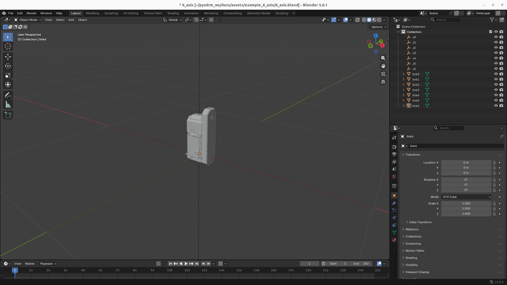{ width="1000" }
</figure>
- Click `link0` -> `Rotation X` and enter `0`. The part should now stand up. Repeat this for all the other parts.

#### 4. Joint–Link Connection
Each link model must be moved under its corresponding joint.

<figure markdown="span">
    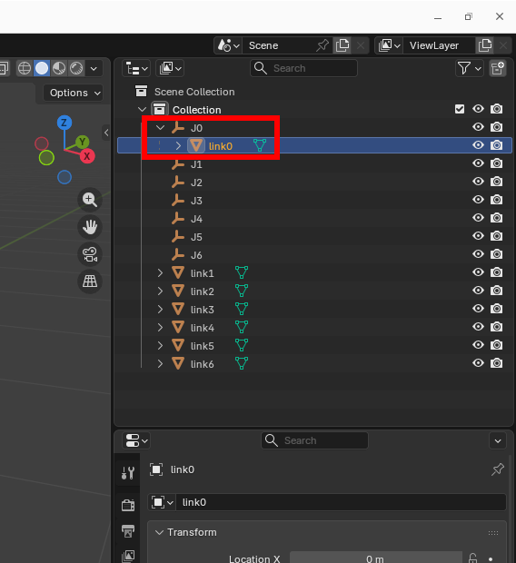
    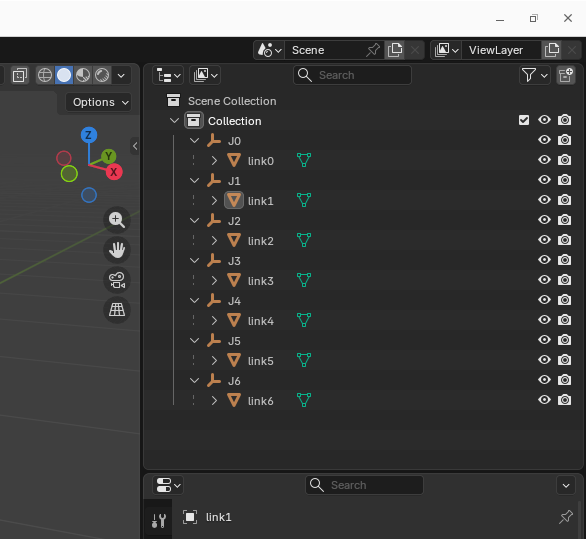
</figure>
- Select `link0` and shift-drag the link to the `J0` joint. `link0` should now lay under `J0`. Repeat it for all the other links.

---

## 2. Hierarchical Structure
The robot must be configured in a serial manipulator configuration.

### 1. Basic Structure
```
World
└── root
    └── links
        └── J0
            ├── link0
            └── J1
                ├── link1
                └── J2
                    ├── link2
                    └── J3
                        ├── link3
                        └── J4
                            ├── link4
                            └── J5
                                ├── link5
                                └── J6
                                    └── link6
```
### 2. Structure Description
| Item | Description |
|------|------|
| World | 3D Tool Basic Scene |
| root | Robot Base Node |
| links | Joint Group |
| J0~Jn | Joint Nodes |
| link0~linkn | Link Model |


### 3. Precautions when Creating a Structure
- All joints (`Jn`) must be set as children of the parent link.
- Each link (`linkn`) must be set as a child of its corresponding joint (`Jn`).
- If the hierarchy is incorrect, the robot structure will not function properly.

---

## 3. Model Creation Method (Blender-Based Example)
This section describes the process of importing an existing robot model into Blender and then modifying its structure and settings to conform to the Structure Specification.

### 1. Basic Environment Settings
1. Launch Blender

### 2. Importing an Existing Robot Model
1. Import an existing robot model file.
    - File → Import → (Select Model Type)

### 3. Resetting Joint and Link Structure

#### 1. Setting Joint Node Names
1. Setting Joint Names
    - Joint: `J0` ~ `Jn`
2. Setting Link Names
    - Link: `link1` ~ `linkn`

#### 2. Resetting Parent-Child Relationships
- Rearrange each joint and link to the following structure:

```
Jn
├ linkn
└ J(n+1)
```

### 3. How to set up a hierarchy in Blender

### 4. Setting Coordinate Axes and Rotation Axes
- Set the rotation axis of each joint (`Jn`) based on the DH parameters.
- Use rotation based on the Local Axis.
- Do not use rotation based on the World Axis.

<figure markdown>
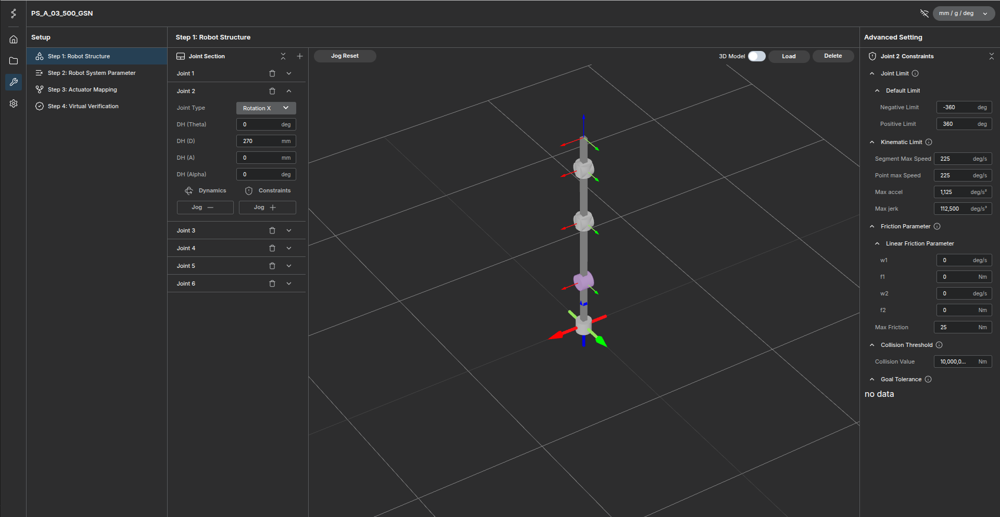
<figcaption>Robot Structure</figcaption>
</figure>
<figure markdown>
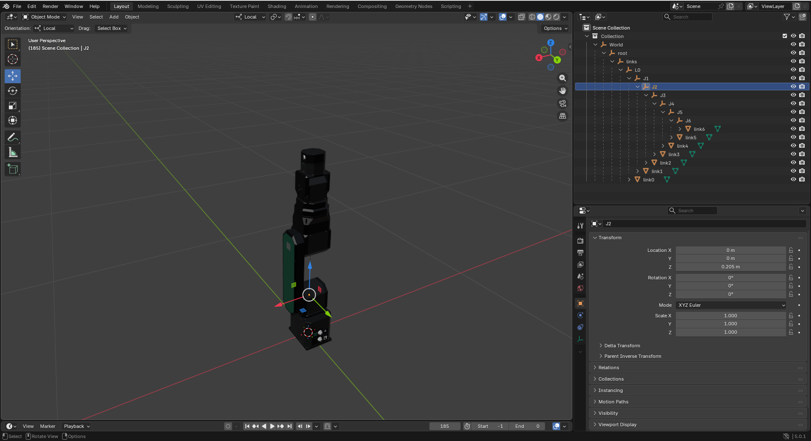
<figcaption>Blender</figcaption>
</figure>
---

## 4. How to Export GLB Files (Blender)

### 1. Export Menu
- File → Export → glTF 2.0 (.glb/.gltf)

### 2. Required Export Options
- Set the following in the Export window:

#### Transform Settings
- `+Y Up`: Disabled
!!! warning "This must be disabled to prevent coordinate transformation errors."

<figure markdown="span">
    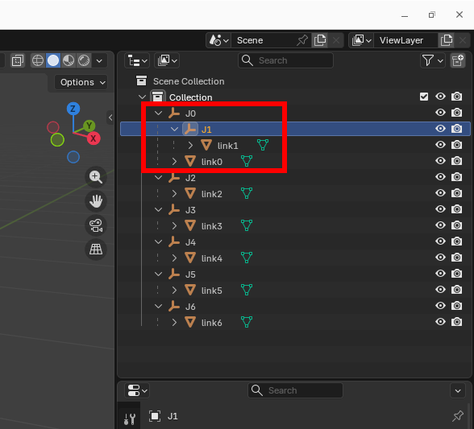
</figure>
- Select `J1` and shift-drag the joint to `J0` joint. Both `J1` and `link1` should be under J0. Repeat same process for `J2` to `J1`, `J3` to `J2` etc. Result should look like picture below.
<figure markdown="span">
    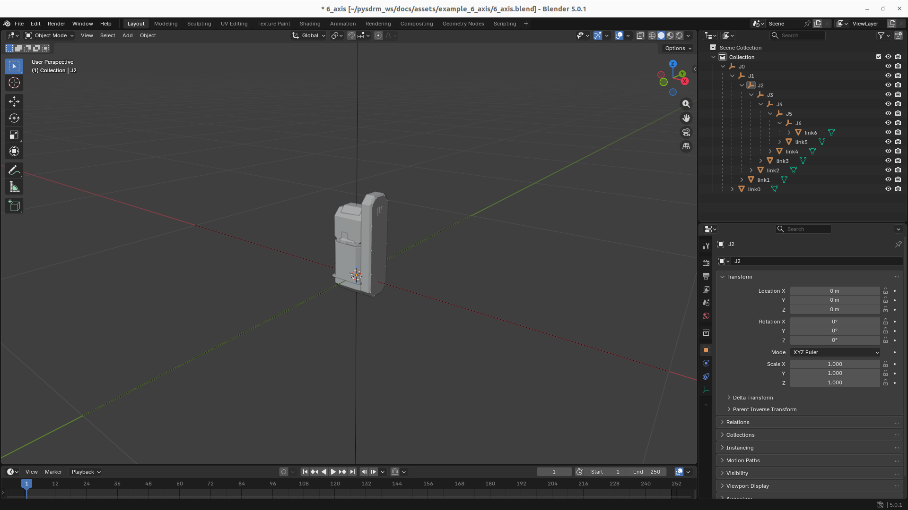{ width="1000" }
</figure>

### 4. Aligning DH Parameters with Model Structure
The joint structure set in Blender must match the DH parameters in Stellar Designer.

#### 1. DH Parameter
DH parameters are defined by transforming each joint coordinate system in the following order: |

    Application order:

    1. Z-axis rotation (θ)
    2. Z-axis translation (d)
    3. X-axis translation (a)
    4. X-axis rotation (α)

    This order cannot be changed and is the default rule for coordinate system calculations.

#### 2. Matching modeling and dh parameters in Blender
<figure markdown="span">
    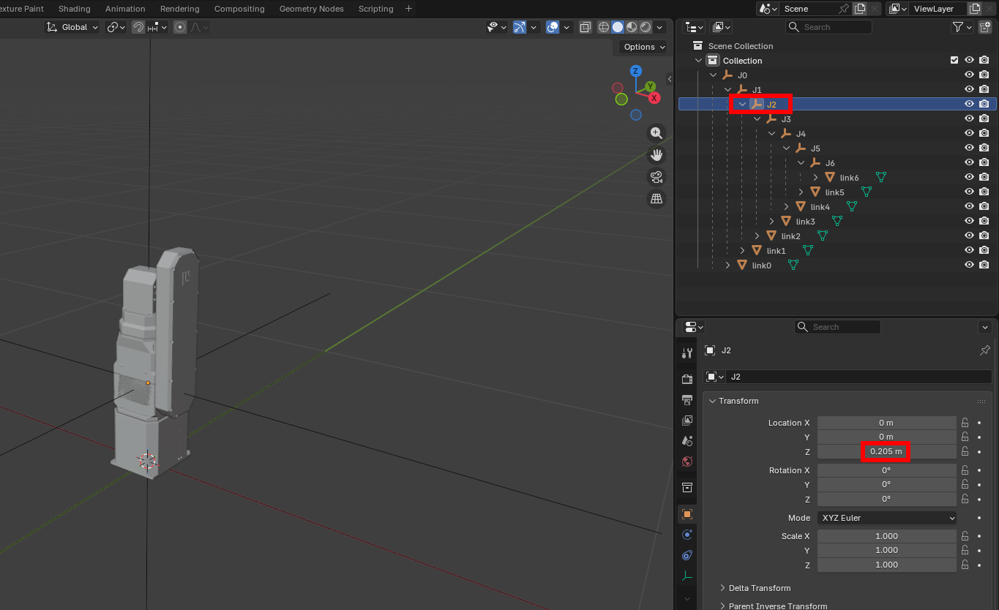{ width="1000" }
</figure>
- Shows the joint hierarchy in Blender.
<figure markdown="span">
    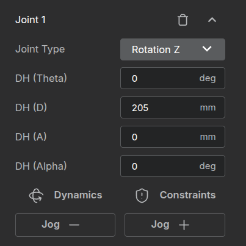{ width="400" }
</figure>
- Shows the DH parameter settings for J1 in Stellar Designer.

This means that J1 is transformed in the following order:

    1. No rotation about the Z-axis (θ = 0)
    2. Translation of 205 mm along the Z-axis (d = 205)
    3. No translation along the X-axis (a = 0)
    4. No rotation about the X-axis (α = 0)

    As a result, the coordinate frame of J2 is generated at a position
    205 mm above J1 along the Z-axis.

- Click `J2` -> `Location z` and enter `0.205`. 
- `link2` and all the other links under `J2` should move upward. 
- These values are same as DH-parameters, so if you have your own robot, you should follow your own values.

<figure markdown="span">
    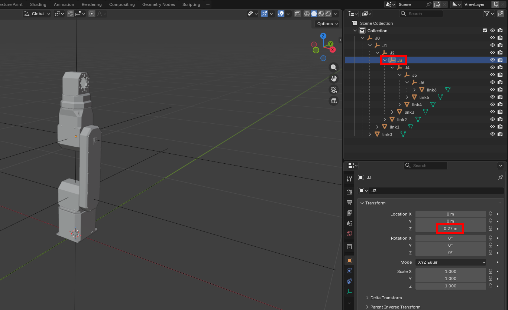{ width="1000" }
    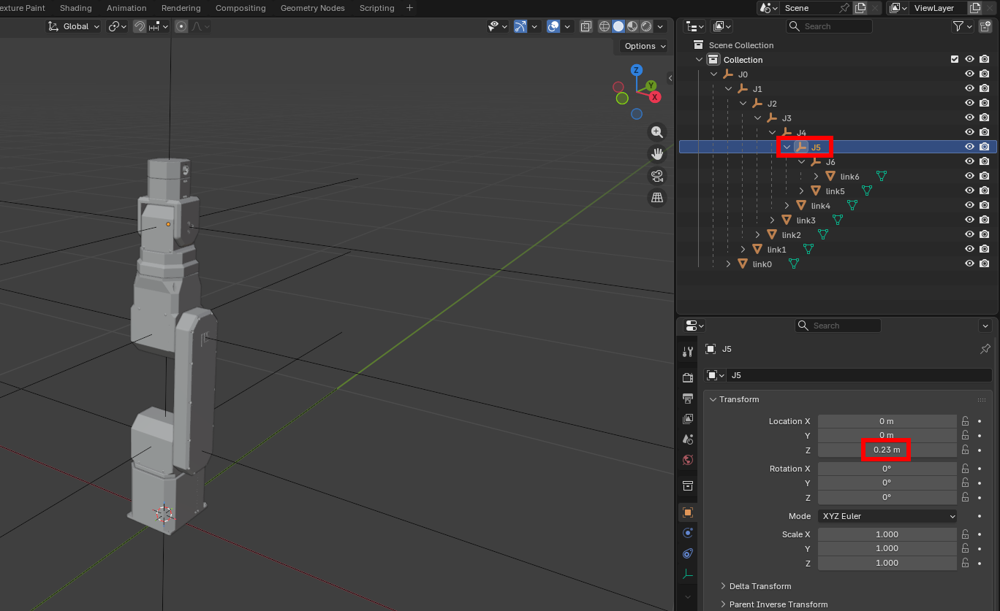{ width="1000" }
    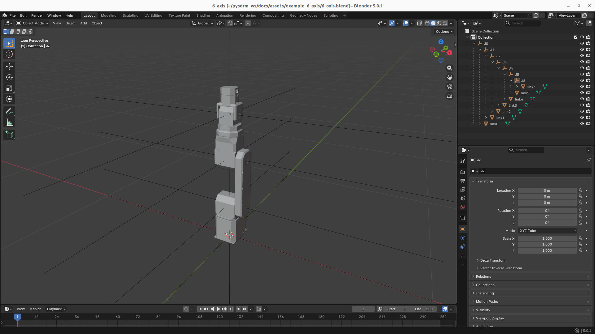{ width="1000" }
</figure>
- For `J3`, enter `0.27`, and for `J5`, enter `0.23`. Final result should look like bottom picture.

When making your own robot, your parts may not align with the axes from DH-parameters. In that case, you have to adjust the position of the mesh itself from your CAD program. The base's position and joint positions when assembled should be { 0.0, 0.0, 0.0 } and 0, respectively.

---


## 3.  How to Export GLB Files (Blender)
<figure markdown="span">
    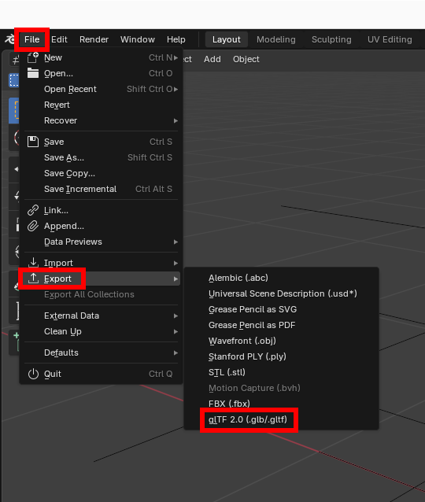
</figure>
- For exporting, click `File` -> `Export` -> `glTF`.

<figure markdown="span">
    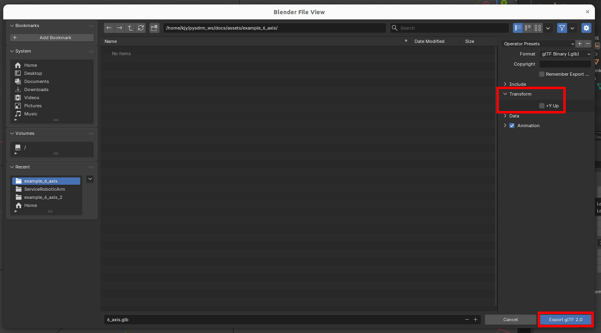{ width="1000" }
</figure>
- Disable `Y Up` option. Name your model and export.

And that should be it. For those who are having troubles, i'll leave download links for final assembly. 

- **[.blend download link](models/example_manipulator_assembly_vis.blend)**
- **[.glb download link](models/example_manipulator_assembly_vis.glb)**

---

## 4. Notes
- Only `.glb` files are used in the final system.
- Blender is a production example tool and is not a required tool.
- The same structure and naming conventions must be maintained when using other tools.
