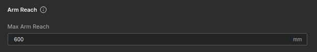
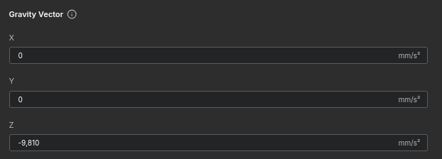
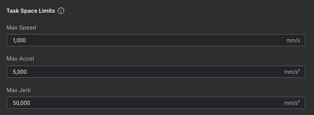
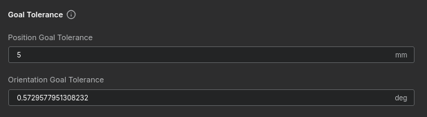

# Building a Simple 2-Bar Robot - Robot System Parameters

In this tutorial, we will configure the global parameters for the robot, including arm reach, gravity, and payload settings. Please follow the steps below and input the values as specified for this example project.

---

## 1. Arm Reach Setup
We need to define the total reach of the robot. For this example, the total length from the base to the Tool Center Point (TCP) corresponds to **600 mm**.

* **Input Value**:
    * Max Arm Reach: `600` mm

<figure markdown="span">
    
    <figcaption>Setting Max Arm Reach</figcaption>
</figure>

---

## 2. Gravity Vector Setup
Set the gravitational acceleration relative to the World Coordinate System. In our setup, gravity acts downwards along the negative Z-axis.

* **Input Value**:
    * X: `0` mm/s²
    * Y: `0` mm/s²
    * Z: `-9,810` mm/s²

<figure markdown="span">
    
    <figcaption>Setting Gravity Vector</figcaption>
</figure>

---

## 3. Max Payload Setup
Set the maximum weight capacity. For this example, we will use a value of **10,000 g**.

* **Input Value**:
    * Max Payload: `10,000` g

<figure markdown="span">
    
    <figcaption>Setting Max Payload</figcaption>
</figure>

!!! info "Since this specific robot operates on a plane parallel to the ground, gravity creates no load (torque) on the actuators. However, we input this value for completeness."

---

## 4. Max Allowable Inertia
This feature is currently reserved for future use. Set the value to 0.

* **Input Value**:
    * Max Allowable Inertia: `0` g/mm²

<figure markdown="span">
    
    <figcaption>Setting Max Allowable Inertia</figcaption>
</figure>

---

## 5. Task Space Limits
Configure the kinematic limits for the Task Space (TCP motion). Enter the values exactly as shown in the image below:

* **Input Value**:
    * Max Speed: `1,000` mm/s
    * Max Accel: `5,000` mm/s²
    * Max Jerk: `50,000` mm/s²

<figure markdown="span">
    
    <figcaption>Setting Task Space Limits</figcaption>
</figure>

---

## 6. Goal Tolerance
Define the arrival criteria for the TCP. Set the values as shown below:

* **Input Value**:
    * Position Goal Tolerance: `5` mm
    * Orientation Goal Tolerance: `0.5729577951308232` deg

<figure markdown="span">
    
    <figcaption>Setting Goal Tolerance</figcaption>
</figure>

---

## Summary
You have successfully configured the global system parameters.

* **Next Step**: Proceed to [Actuator Mapping](../map_actuators/index.md) to connect these settings to physical motors.