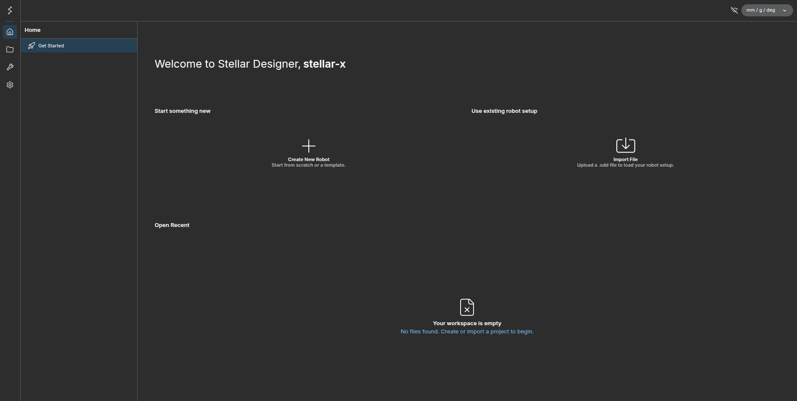
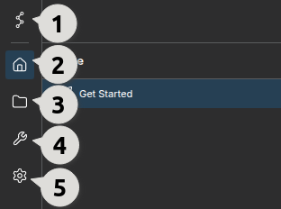
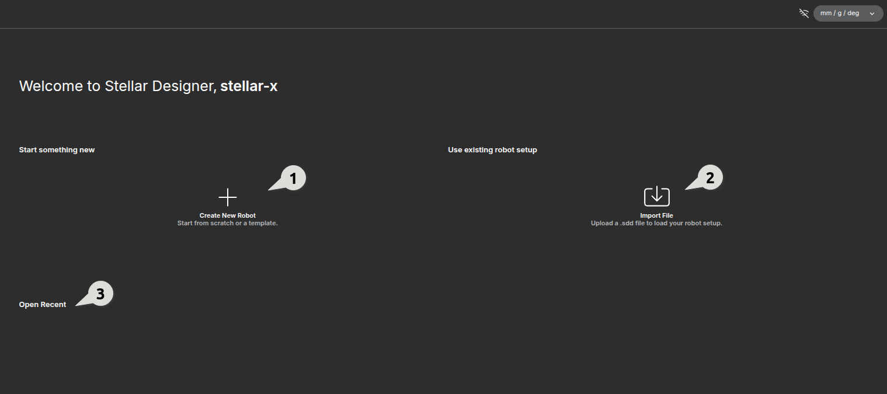
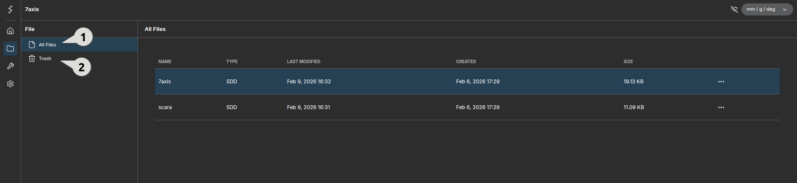
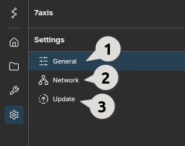

# Introduction

## What is Stellar Designer?
Stellar Designer is a software toolkit for defining the structure of a serial manipulator. You can easily configure the structure of manipulators by using an intuitive GUI. 
It also allows you to map kinematic structures to actuators, accounting for transmission chains like gearbox reduction ratios.

## Main Screen and Basic Buttons

<figure markdown="span">
  
  <figcaption>Main Screen of Stellar Designer</figcaption>
</figure>

<figure markdown="span">
  
  <figcaption>Side Navigation Bar Overview</figcaption>
</figure>

### 1. Menu Button
<figure markdown="span">
  
  <figcaption>Expanded Main Menu Options</figcaption>
</figure>

Clicking this icon expands the menu window as shown below. 
The File tab is particularly useful for adjusting themes within the Preferences section or for directly accessing Stellar Motion Studio.

### 2. Home Button

Click this icon to return to the Home screen. 
From here, you can start a project by creating a new robot ① or importing an existing Stellar SDD file ②. Additionally, recently opened files are displayed here, allowing you to resume a project immediately by clicking on it.

<figure markdown="span">
  
  <figcaption>Home Screen Dashboard</figcaption>
</figure>

### 3. File Button

This section lists all project files currently stored in Stellar Designer. 

<figure markdown="span">
  
  <figcaption>File Management Interface</figcaption>
</figure>

① Displays a list of all project files within Stellar Designer, as shown on the right.
② Retains deleted files in the Trash. From here, you can either restore files or permanently delete them (making them unrecoverable).

### 4. Setup Button

This window is where the core robot configuration begins. Here, you define kinematics and dynamics settings, as well as global robot parameters and hardware connectivity specifications (such as reduction ratios and EtherCAT configurations).

<figure markdown="span">
  
  <figcaption>Robot Configuration Interface</figcaption>
</figure>

### 5. Settings Button

This is the settings window for Stellar X. You can configure the Stellar X hostname, administrator password, network settings, and check the device update status on this page. 

<figure markdown="span">
  
  <figcaption>System Setup Configuration</figcaption>
</figure>

① General
On this page, you can set the Stellar X device name recognized by routers, and specify the default project to be loaded at startup. You can also set the administrator password (initial password: `sodero`) and configure the product image displayed on the loading page.

② Network : Allows you to configure IP settings for each Ethernet port. `eth1` is fixed to 10.0.0.1 by default. 

③ Update : Allows you to check the update status of the device.

---

Now that the basic introduction is complete, let's proceed to the [next page](../robot_structure/index.md) and start building a robot.