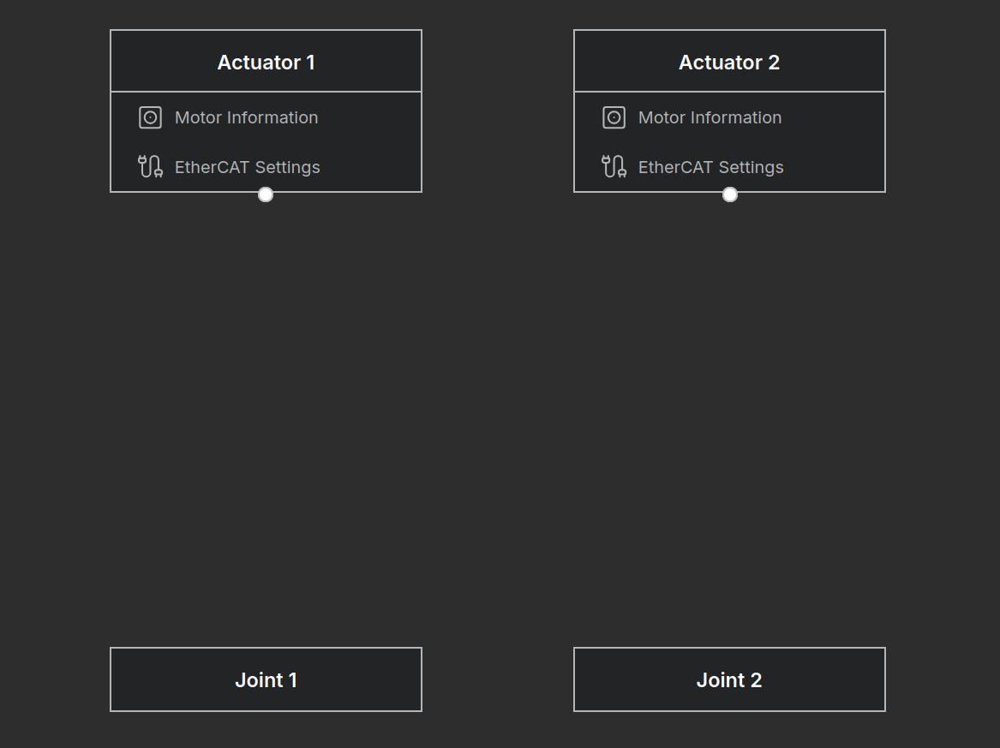
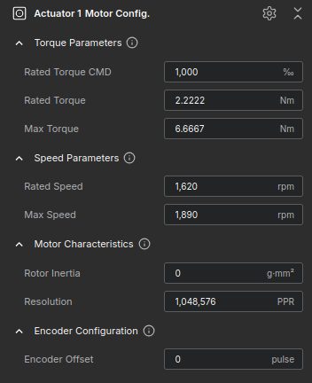
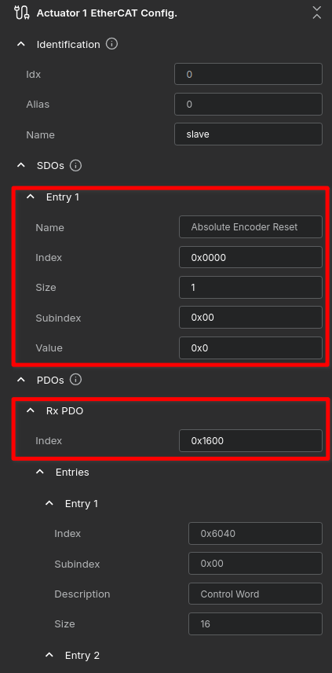
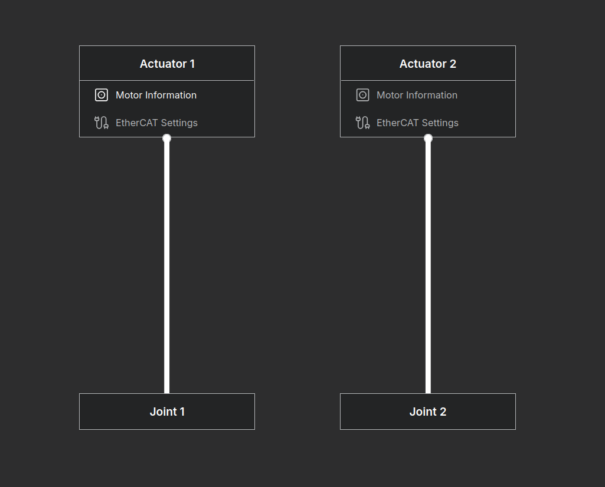

# Building a Simple 2-Bar Robot - Actuator Mapping

## Setting up Actuators (Example: Synapticon JD Series)

In the previous section, we completed the modeling of the robot's kinematics and dynamics. Now, we must map this theoretical model to the physical hardware: the **Actuators**.

This tutorial guides you through mapping your theoretical robot model to physical Synapticon JD8/JD10 actuators. Follow these steps to get your robot running quickly. The goal is to mount a **JD10 on Joint 1** and a **JD8 on Joint 2**.

### Step 1: Verify Actuator Nodes
Upon entering the **Actuator Mapping** page, verify that the actuator and joint nodes have been automatically generated based on your previous robot structure configuration.
**Status:** Ensure nodes are visible (currently in an **Unlinked** state).

!!! warning "Troubleshooting: Node Count Mismatch"
    * If the number of Actuators and Joints does not appear as expected (2 pairs for this tutorial), please return to the **Robot Structure** tab.
    * **Check Joint Type:** Verify that the Joint Type is set to **Rotation Z**. If set to **None**, it is not counted as a valid Degree of Freedom (DoF) and will not generate a mapping node.

<figure markdown="span">
    
    <figcaption>Screen displaying actuators and joints.</figcaption>
</figure>

### Step 2: Input Motor Specifications
1.  Click the **[Motor Information]** button on the actuator node.
2.  Refer to the specifications below and enter the data into the right panel.

**Actuator 1 (Joint 1): Synapticon JD10**

| Parameter | Specification |
| :--- | :--- |
| **Product Name** | ACTILINK-JD Circulo 10 |
| **Rated Torque** | 2.2222 Nm |
| **Peak Torque** | 6.6667 Nm |
| **Rated Output Power** | 380 W |
| **No-Load Speed** | 1,890 rpm |
| **Rated Load Speed** | 1,620 rpm |

**Actuator 2 (Joint 2): Synapticon JD8**

| Parameter | Specification |
| :--- | :--- |
| **Product Name** | ACTILINK-JD Circulo 8 |
| **Rated Torque** | 0.774 Nm |
| **Peak Torque** | 2.194 Nm |
| **Rated Output Power** | 170 W |
| **No-Load Speed** | 3,100 rpm |
| **Rated Load Speed** | 2,131 rpm |

!!! info "Ignore the **Gear Ratio** field in this step. it will be handled in the Transmission setup (Step 4)."

<figure markdown="span">
    
    <figcaption>Actuator 1 specs entered (Referencing Synapticon JD10).</figcaption>
</figure>

### Step 3: Configure EtherCAT Communication
Click **[EtherCAT Settings]** to configure the driver communication.

1.  **SDO Settings:** For Synapticon drives, **skip the SDO Entry 1**.
    * *Note:* These drives use a transactional safety model. Perform the Absolute Encoder Reset using the manufacturer's dedicated software instead.
2.  **PDO Settings:** Set the indices for **User-Defined Mapping**.
    * **RxPDO (Master to Driver):** Set mapping index to **0x1600**. Ensure it maps `Control Word`, `Target Position`, etc.
    * **TxPDO (Driver to Master):** Set mapping index to **0x1A00**. Ensure it maps `Status Word`, `Actual Position`, etc.

<figure markdown="span">
    
    <figcaption>Edit the SDO and RxPDO settings.</figcaption>
</figure>

### Step 4: Configure Transmission (Actuator-Joint Mapping)
Finally, we connect the actuators to the joints. For this 2-Bar robot, we use a simple **1:1 Mapping** strategy where each motor drives exactly one joint.

**Procedure:**

1.  Switch the view to **Diagram Mode**.
2.  Click **Add Edge** to draw connection lines.
3.  Connect **Actuator 1** to **Joint 1**.
4.  Connect **Actuator 2** to **Joint 2**.

<figure markdown="span">
    
    <figcaption>Actuator Mapping</figcaption>
</figure>

**Setting the Transmission Values:**
You must input the reduction ratio (inverse of gear ratio) for each connection.

!!! info "Do not enter fractions (e.g., `1/9`). You must calculate and enter the **decimal value**."

**Connection 1 (JD10 → Joint 1):**

* The JD10 has a gear ratio of **9 : 1**.
* Calculation: `1.0 / 9.0 ≈ 0.111111`
* **Input Value:** `0.111111`

**Connection 2 (JD8 → Joint 2):**

* The JD8 has a gear ratio of **7.75 : 1**.
* Calculation: `1.0 / 7.75 ≈ 0.129032`
* **Input Value:** `0.129032`

!!! idea "**Direction Tip:** If a joint rotates in the opposite direction of the command during testing, simply change this value to a negative number (e.g., `-0.111111`)."

Proceed to [Virtual Verification](../verify_configuration/index.md) to verify the robot's movement through simulation.
