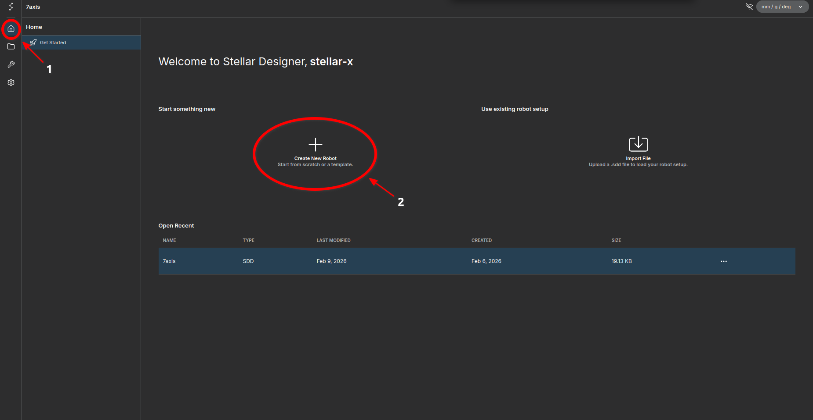
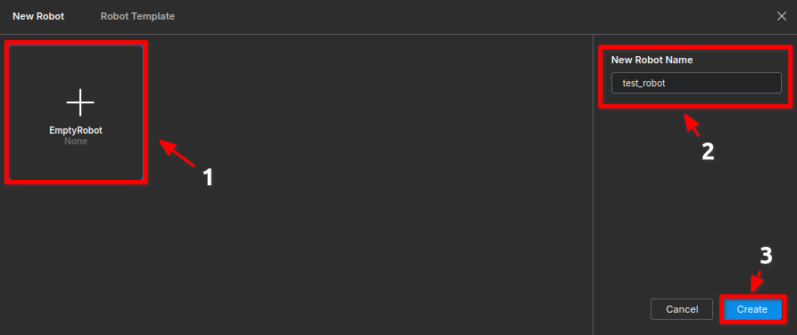
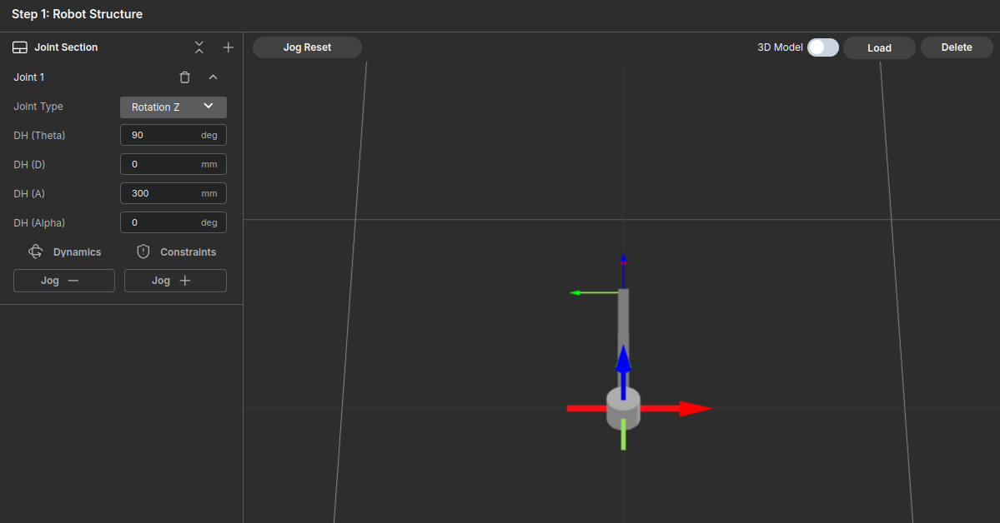
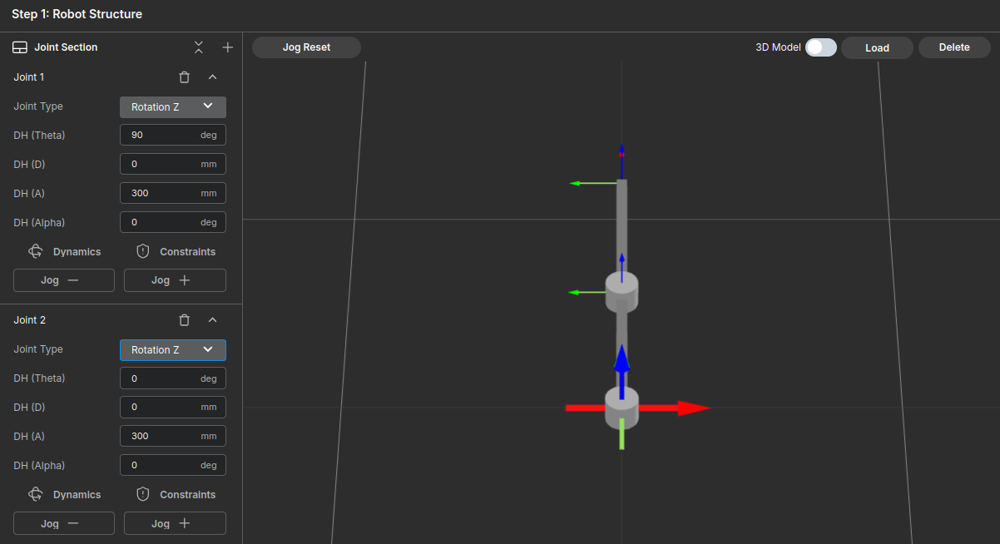
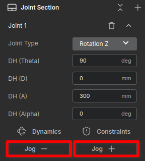
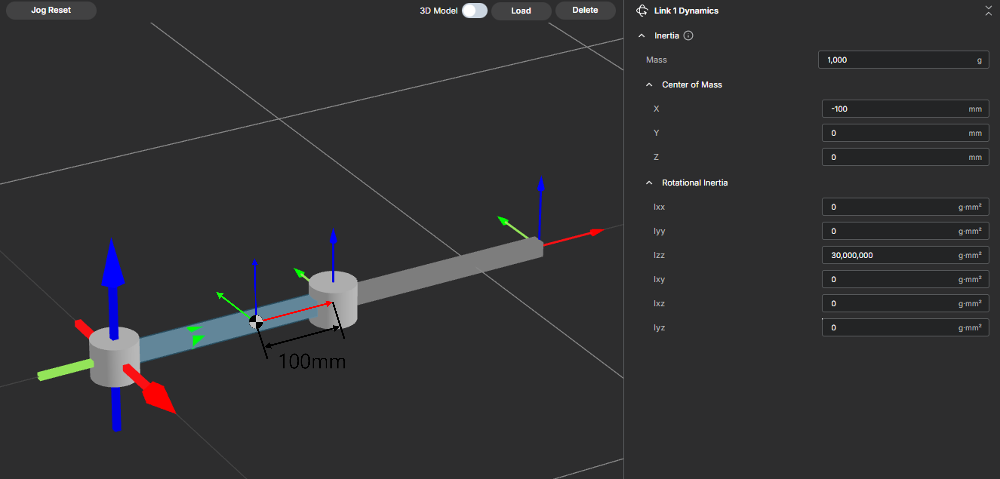
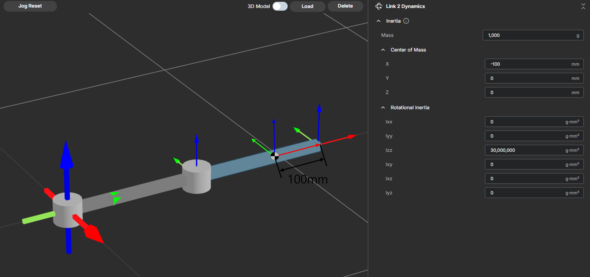
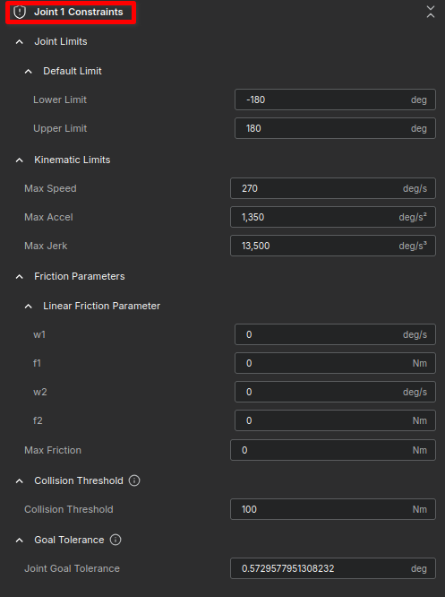
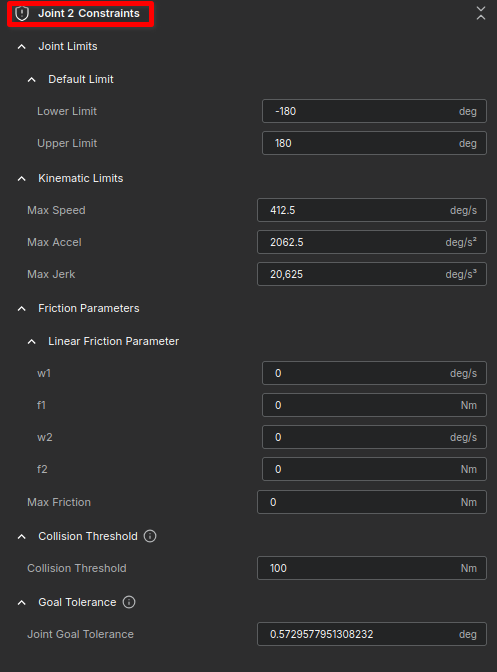

# Building a Simple 2-Bar Robot - Robot Structure

In this tutorial, we will walk through the process of creating a simple "2-bar" robot. By following these steps, you will learn the basic workflow of robot creation, structure setup, and parameter configuration without getting bogged down in complex theories.

**Goal:** Create a 2-link robot named `test_robot`.

<figure markdown="span">
    
    <figcaption>Conceptual Image of a 2-Bar Robot</figcaption>
</figure>

---

## Step 1: Create a New Robot

1. Navigate to the **Home** screen.
2. Click the **Create New Robot** button.

<figure markdown="span">
    { width="1000" }
    <figcaption>Click the <strong>Create New Robot</strong> button</figcaption>
</figure>

3. In the setup screen:
    - Select **EmptyRobot**.
    - Enter the name: `test_robot`.
    - Click **Create**.

<figure markdown="span">
    { width="1000" }
    <figcaption>Select <strong>EmptyRobot</strong> and name it <code>test_robot</code></figcaption>
</figure>

---

## Step 2: Structure Setup (DH Parameters)

We will construct the skeleton of the robot by adding joints and setting their lengths.

### 1. Add Joints
- Click the `+` button on the right side of the **Joint Section** to add two joints.

### 2. Configure Link 1
Enter the parameters as follows to create a 300mm link along the Y-axis:

* **Input Values**:
    * Theta ($\theta$) : `90` deg
    * D: `0` mm
    * A: `300` mm
    * Alpha ($\alpha$) : `0` deg
    * Joint Type: `Rotation Z`

<figure markdown="span">
    { width="1000" }
    <figcaption>Creation of Link 1</figcaption>
</figure>

### 3. Configure Link 2
Set up the second link with the following values:

* **Input Values**:
    * Theta ($\theta$) : 0 deg
    * D: `0` mm
    * A: `300` mm
    * Alpha ($\alpha$) : `0` deg
    * Joint Type: `Rotation Z`

<figure markdown="span">
    { width="1000" }
    <figcaption>Creation of Link 2</figcaption>
</figure>

### 4. Verify Movement

Use the **Jog** tab to ensure the joints rotate correctly.

- **Jog**: Moves the robot.
- **Jog Reset**: Returns the moved robot to its origin.

<figure markdown="span">
    
    <figcaption>Jog Control Interface</figcaption>
</figure>

---

## Step 3: Dynamics Configuration

Now we apply physical properties to the robot. For this tutorial, simply input the approximate values provided in the screenshots.

!!! info "For detailed definitions of Coordinate Systems and Mass calculations, please refer to the **User Guide**."

1. Click **Dynamics** in the Joint Section.
2. Enter the values for **Mass**, **Center of Mass**, and **Inertia** as shown below.

### Link 1 Settings
<figure markdown="span">
    { width="1000" }
    <figcaption>Link 1 Inertia Settings</figcaption>
</figure>

### Link 2 Settings
<figure markdown="span">
    { width="1000" }
    <figcaption>Link 2 Inertia Settings</figcaption>
</figure>

---

## Step 4: Constraints Setup

Finally, we configure the safety limits and friction parameters.

1. Click the **Constraints** button in the Joint Section.
2. Match the settings in the images below for each joint.

### Joint 1 Constraints

* **Input Values**:
    * Lower Limit ($\theta$): `-180` deg
    * Upper Limit: `180` deg
    * Max Speed: `270` deg/s
    * Max Accel: `1,350` deg/s²
    * Max Jerk: `13,500` deg/s²
    * w1: `0` deg/s
    * f1: `0` Nm
    * w2: `0` deg/s
    * f2: `0` Nm
    * Max Friction: `0` Nm
    * Collision Threshold: `100` Nm
    * Join Goal Tolerance: `0.5729577951308232` deg

<figure markdown="span">
    
    <figcaption>Constraints Settings for Joint 1</figcaption>
</figure>

### Joint 2 Constraints

* **Input Values**:
    * Lower Limit ($\theta$): `-180` deg
    * Upper Limit: `180` deg
    * Max Speed: `412.5` deg/s
    * Max Accel: `2062.5`deg/s²
    * Max Jerk: `20,625` deg/s²
    * w1: `0` deg/s
    * f1: `0` Nm
    * w2: `0` deg/s
    * f2: `0` Nm
    * Max Friction: `0` Nm
    * Collision Threshold: `100` Nm
    * Join Goal Tolerance: `0.5729577951308232` deg

<figure markdown="span">
    
    <figcaption>Constraints Settings for Joint 2</figcaption>
</figure>

---

## Summary

Congratulations! You have successfully:

1. Created a robot skeleton using DH parameters.
2. Applied dynamic properties.
3. Configured safety constraints.

Your `test_robot` is now ready for simulation or control tasks. Proceed to [Robot System Parameters](../configure_system_parameters/index.md) to configure the global robot parameters.