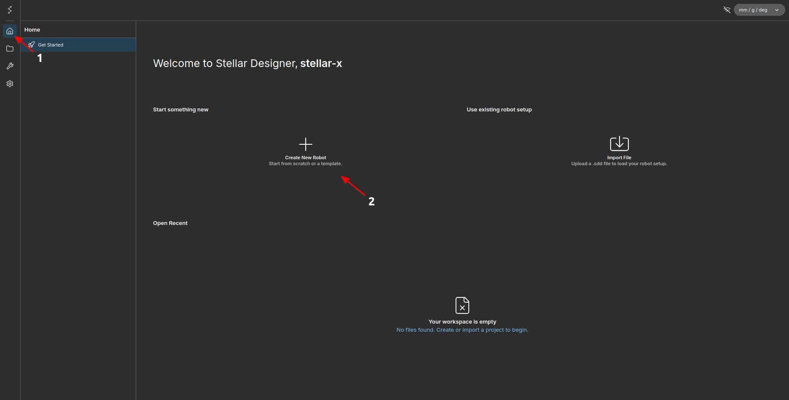
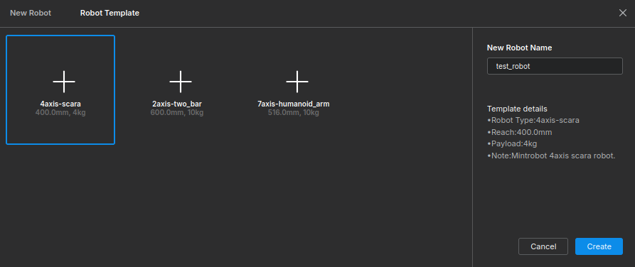
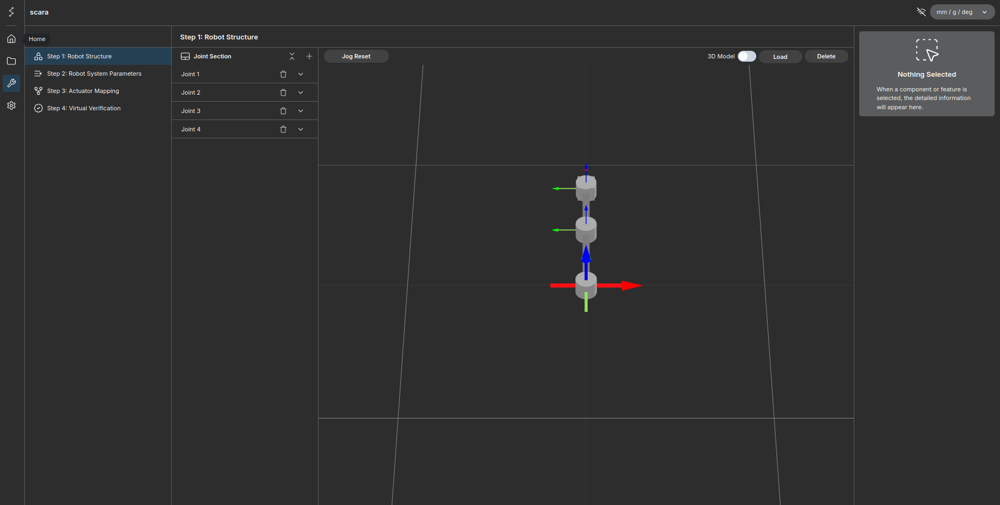

# Creating a Robot from a Template (4-Axis SCARA)

In the previous example, we took the time to build a 2-bar robot project from scratch. This time, we will explore how to start with a pre-configured template. 

Currently, templates are available for 2-axis, 4-axis, and 7-axis robots. In this chapter, we will create a 4-axis SCARA robot using its respective template.

---

## Step 1: Create a New Robot

First, navigate to the **Home** screen and click the **Create New Robot** button.

<figure markdown="span">
    { width="1000" }
    <figcaption>Click the <strong>Create New Robot</strong> button on the Home screen</figcaption>
</figure>

---

## Step 2: Select the Template

1. In the creation menu, select **Robot Template**.
2. Choose the **4-Axis SCARA** option from the list.
3. Enter your desired robot name.
4. Click **Create**.

<figure markdown="span">
    { width="1000" }
    <figcaption>Select <strong>Robot Template</strong>, choose the 4-Axis SCARA, and click Create</figcaption>
</figure>

---

## Step 3: Virtual Verification

Once the robot is created, you will be directed to the main setup screen.

<figure markdown="span">
    { width="1000" }
    <figcaption>Main Setup Screen for the SCARA Robot</figcaption>
</figure>

Since the template pre-fills the structural and dynamic configurations, you can bypass those steps and test the robot immediately:
1. Navigate directly to the **Virtual Verification** tab.
2. Click **Activate Simulation**.

---

## Conclusion

You have successfully set up a SCARA robot using a provided template! 

Since physical servo motors are likely not connected or prepared at this stage, you can test your setup in a simulated environment. The tutorial for integrating and communicating with Isaac Sim (via the Stellar Bridge extension) is covered in detail here: [Link to Isaac Sim Integration Tutorial](../../simulation/introduction/index.md)
