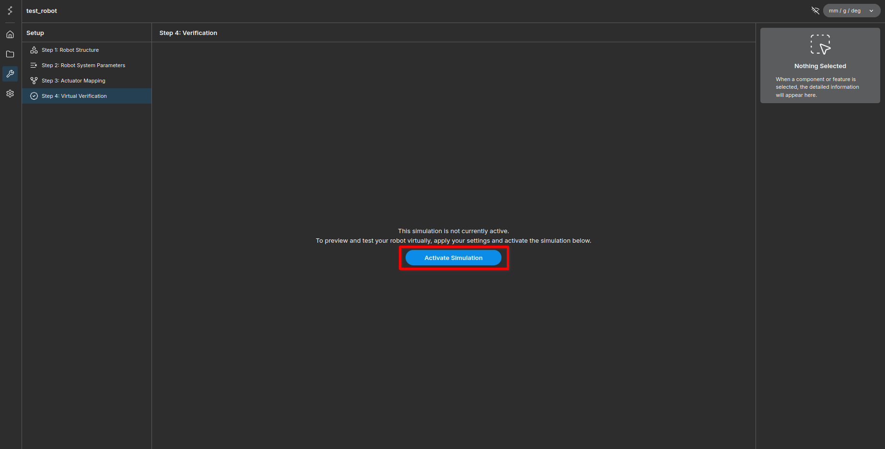
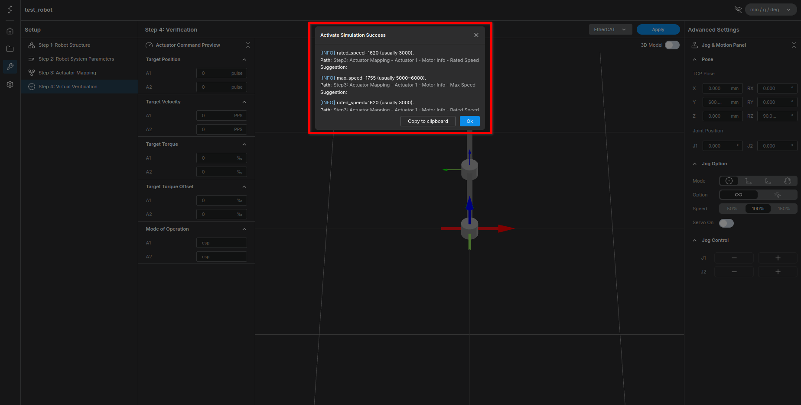
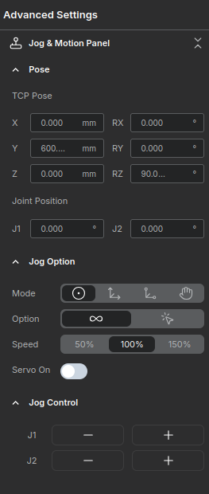
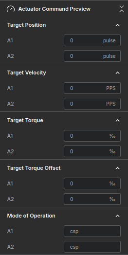
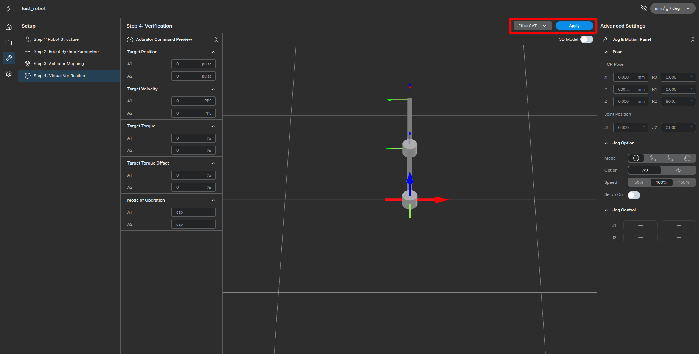
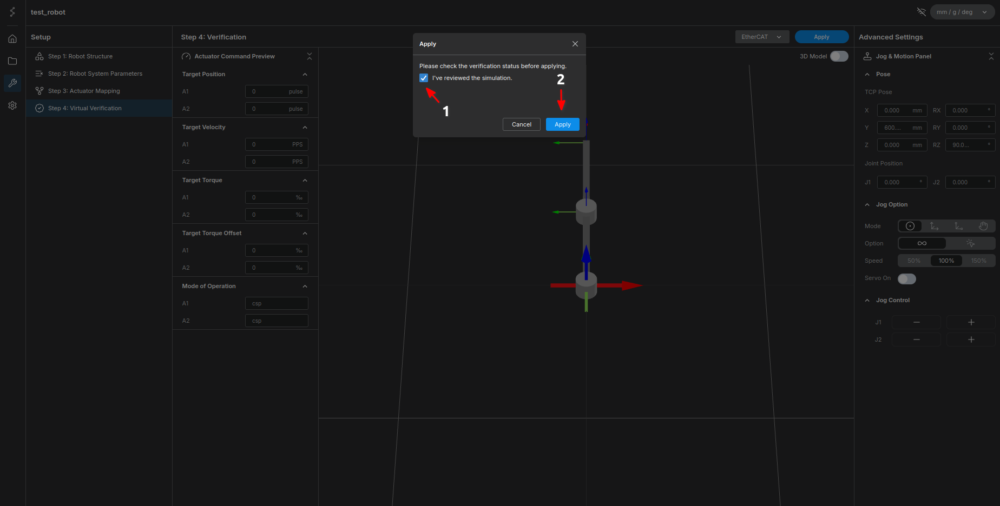
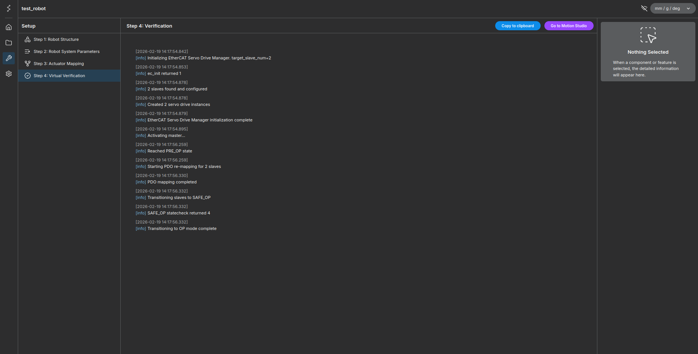
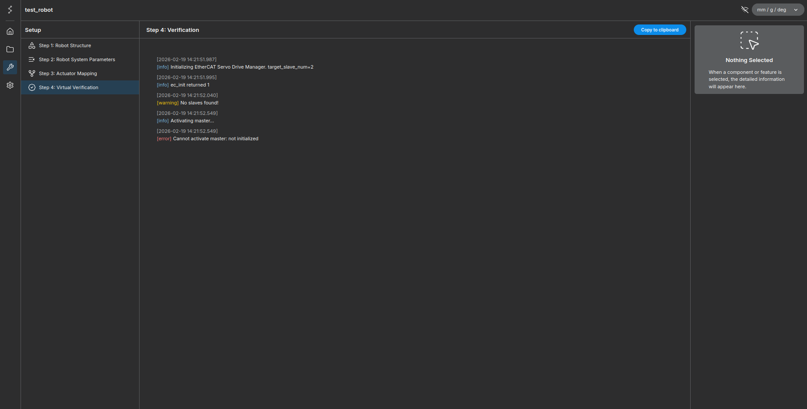
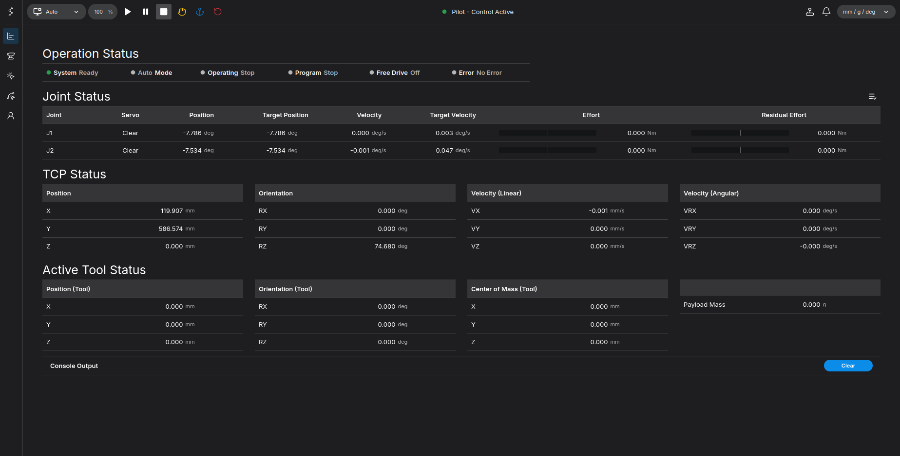

# Building a Simple 2-Bar Robot - Virtual Verification

In the previous chapter, we mapped the theoretical robot structure to the actual hardware. Now that the mapping is complete, we will verify the robot's movement through a virtual simulation before deploying it to the real hardware.

!!! info "**Prerequisite:** This tutorial assumes that the EtherCAT slaves (servo drivers) are properly configured, connected, and ready for operation."

**Goal:** Verify the `test_robot` configuration via simulation and activate the EtherCAT Master for real-world control.

<figure markdown="span">
    { width="1000" }
    <figcaption>Virtual Verification Interface</figcaption>
</figure>

---

## Step 1: Virtual Verification

First, we must verify that the appropriate parameters were entered in the previous steps.

1. Click the **Activate Simulation** button.
2. The system will verify the robot parameters. Once verified, the simulation will start automatically.

### Verification Results
If there are no issues with the parameters, the system log will display a success message.

!!! info "**Status:** `Activate Simulation Success`"

<figure markdown="span">
    { width="1000" }
    <figcaption>Simulation Success Log</figcaption>
</figure>

---

## Step 2: Jog Control & Monitoring

Once the simulation is active, you can manually control the robot to check its behavior.

1. Locate the **Jog Panel** on the right side of the screen.
2. Click **Servo On** to enable motor control.
3. Use the **Jog Control** buttons to move the robot joints.

<figure markdown="span">
    
    <figcaption>Jog Control Panel</figcaption>
</figure>

### Monitoring Command Values
As you move the robot, you can monitor the target values being sent to the servo drivers in real-time.

<figure markdown="span">
    
    <figcaption>Actuator Command Preview</figcaption>
</figure>

---

## Step 3: Real Robot Activation (EtherCAT)

After verifying the motion in the simulator, we will activate the EtherCAT Master to operate the real robot.

1. Click the **Apply** button located at the top right of the screen.

<figure markdown="span">
    { width="1000" }
    <figcaption>Location of the Apply Button</figcaption>
</figure>

2. A confirmation dialog will appear.
3. Check the box to confirm that you have verified the target values via simulation.
4. Click **Apply** to proceed.

<figure markdown="span">
    
    <figcaption>Safety Confirmation Checkbox</figcaption>
</figure>

---

## Step 4: Final Validation

The system will attempt to initialize the EtherCAT communication.

### Scenario A: Success
If successful, the logs will show the connection details, and a **Go to Motion Studio** button will appear in the top right corner.

<figure markdown="span">
    { width="1000" }
    <figcaption>EtherCAT Connection Success</figcaption>
</figure>

### Scenario B: Failure
If the connection fails, the log will display the specific reason (e.g., communication timeout, parameter mismatch).

<figure markdown="span">
    { width="1000" }
    <figcaption>Error Log Example</figcaption>
</figure>

!!! error "**Troubleshooting:** If you encounter an error, correct the indicated parameters in the previous sections, return to the **Virtual Verification** page, and repeat the process."

---

## Setup Complete

Once the connection is successful, click **Go to Motion Studio** to enter the main control interface.

<figure markdown="span">
    { width="1000" }
    <figcaption>Motion Studio Interface</figcaption>
</figure>

Congratulations! You have successfully completed the **Real Robot Setup** for your 2-bar robot. 

In the next chapter, we will introduce the features and capabilities of [**Motion Studio**](../../stellar_motion_studio/about_stellar_motion_studio/index.md).