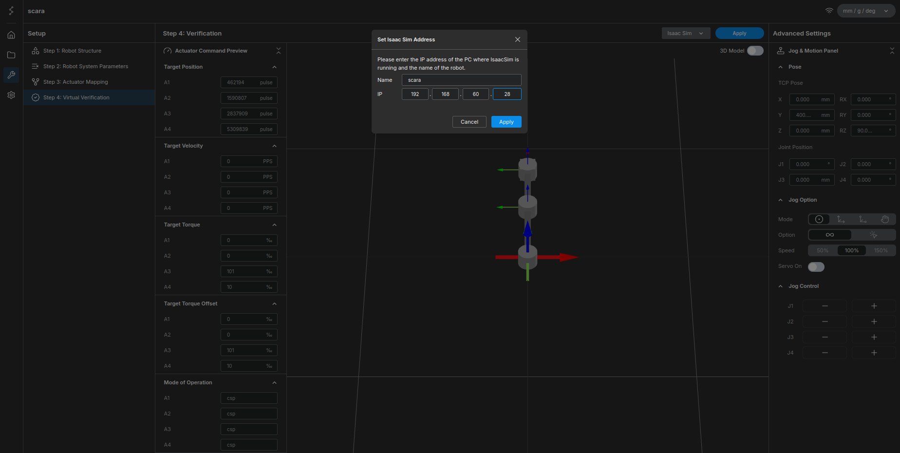

# What is Stellar Motion Studio?

Once you have configured a robot using Stellar Designer, you need an interface to teach and control it. While robot manufacturers typically provide a physical teach pendant, the StellarX platform delivers this functionality through a streamlined web application: Stellar Motion Studio. 

- **Web-based teach pendant**: Replaces traditional hardware interfaces with an accessible, browser-based program for robot teaching and control.
- **Comprehensive control suite**: Provides the essential tools you need to operate your robot, including manual jogging, tool configuration, and saving taught poses.
- **Real-time diagnostics**: Allows you to monitor live robot status values and run API tests directly within the studio environment.
- **Universal adaptability**: Delivers a consistent user experience. Even if your robot's physical configuration or kinematics change, you can continue working within the exact same interface.

---

## Motion Studio Tutorial: Getting Started

In this tutorial, we will explore the features of Motion Studio by first creating a 4-axis SCARA robot using Stellar Designer. 

To get started, let's generate a SCARA robot from [Start from Templates](../../stellar_designer/start_from_templates/index.md). Once generated, click **Apply** while the Isaac Sim environment is running. 

Set the robot's name to `scara` and the IP address to the IP of your PC where Isaac Sim is running, as shown in the configuration below:

<figure markdown="span">
    { width="1000" }
    <figcaption>Configuring the SCARA robot name and IP address in Stellar Designer</figcaption>
</figure>

After applying the settings, click the **Go to Motion Studio** button. The Motion Studio interface will launch and appear as follows:

<figure markdown="span">
    { width="1000" }
    <figcaption>The initial interface of Stellar Motion Studio</figcaption>
</figure>

Proceed to the [next chapter](../home/index.md) to explore the Home screen and learn basic jog control.