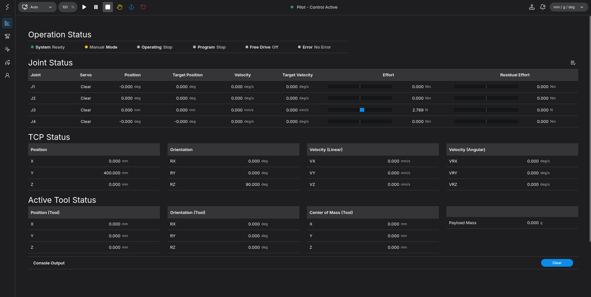
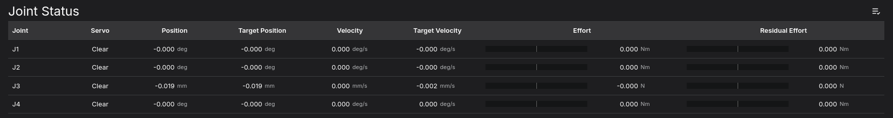
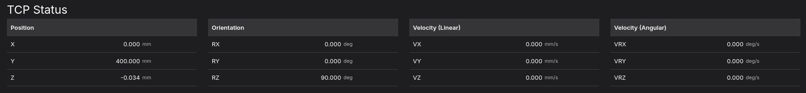
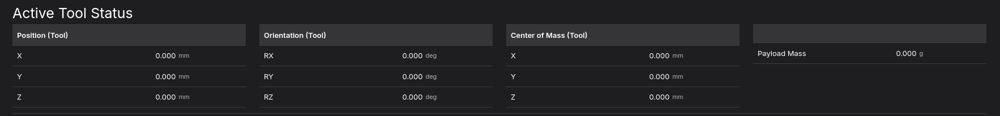
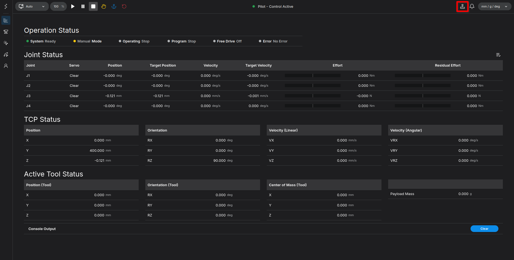
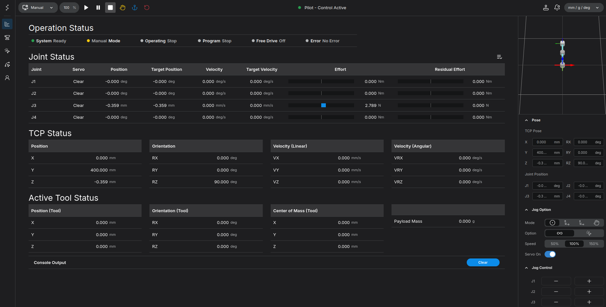
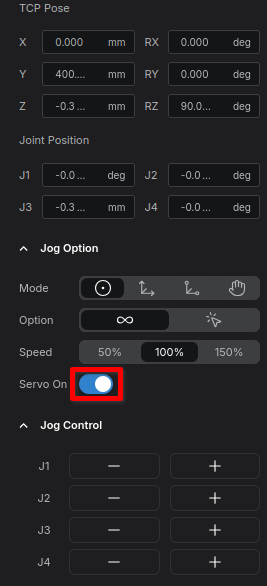
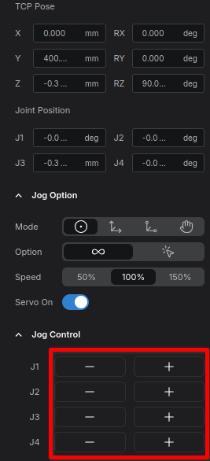

# Home Screen Overview and Basic Jog Control

In this tutorial, we will explore the main dashboard of the robot interface and learn how to perform basic manual movements (jogging). By following these steps, you will understand how to monitor the robot's current state and safely operate its joints.

**Goal:** Understand the Home screen indicators and learn how to use the Jog panel to move the robot.

---

## Part 1: Exploring the Home Screen

The Home screen is your primary dashboard. Here, you can monitor the real-time status of each joint, the TCP (Tool Center Point), and the currently equipped tool.

<figure markdown="span">
    { width="1000" }
    <figcaption>Overview of the Home Screen</figcaption>
</figure>

### 1. Joint Status
This section displays the current state of the robot's axes. Since this is a 4-axis robot, you will see the status values for joints **J1 through J4**.

<figure markdown="span">
    
    <figcaption>Joint Status Indicator (J1 - J4)</figcaption>
</figure>

### 2. TCP Status
This panel shows the pose (position and orientation) of the robot's end effector.

!!! info "For the orientation values in the TCP status, the system uses the **Rotation Vector Convention**"

<figure markdown="span">
    
    <figcaption>TCP (Tool Center Point) Status</figcaption>
</figure>

### 3. Active Tool Status
This section displays the status of the currently equipped tool. Since no tool is currently mounted, you can see that the values for Position (Tool), Orientation (Tool), Center of Mass (Tool), and Payload Mass are all zero.

<figure markdown="span">
    
    <figcaption>Active Tool Status Panel</figcaption>
</figure>

---

## Part 2: Operating the Robot (Jogging)

Now that we understand the interface, let's learn how to manually move the robot using the Jog panel.

### Step 1: Open the Jog Panel
To begin, locate and click the **Joystick icon** situated in the top right corner of the screen.

<figure markdown="span">
    
    <figcaption>Click the Joystick icon in the top right</figcaption>
</figure>

Clicking this will open the **Jog Panel** on the right side of the screen, providing you with the necessary controls to move the robot.

<figure markdown="span">
    { width="1000" }
    <figcaption>The Jog Panel appears on the right tab</figcaption>
</figure>

### Step 2: Enable Servo On
Before the robot can physically move, you must supply power to the joint motors. This process is called turning the "Servo On."

- Click the **Servo On** button. You will see an indication that the servos are now active and ready for commands.

<figure markdown="span">
    
    <figcaption>Click to turn the Servo On</figcaption>
</figure>

### Step 3: Use the Jog Controls
With the servos active, you can now move individual joints.

1. Locate the **`+`** and **`-`** buttons for each joint within the Jog control panel.
2. Click and **hold** a button to move the corresponding joint.
3. **Release** the mouse button to stop the movement immediately. 

<figure markdown="span">
    
    <figcaption>Press and hold the + / - buttons to jog the robot</figcaption>
</figure>

---

## Summary
Congratulations! You have successfully learned how to:

1. Read the Joint, TCP, and Active Tool status on the Home screen.
2. Access the Jog panel.
3. Enable the servo motors.
4. Manually control the robot using the press-and-hold jog buttons.

Proceed to the [next chapter](../tool/index.md) to configure your tool and payload settings.