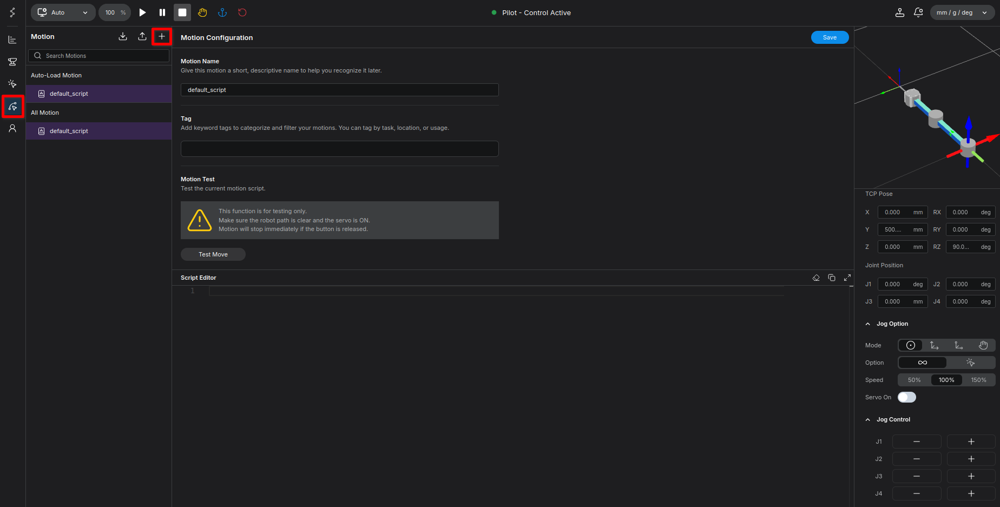
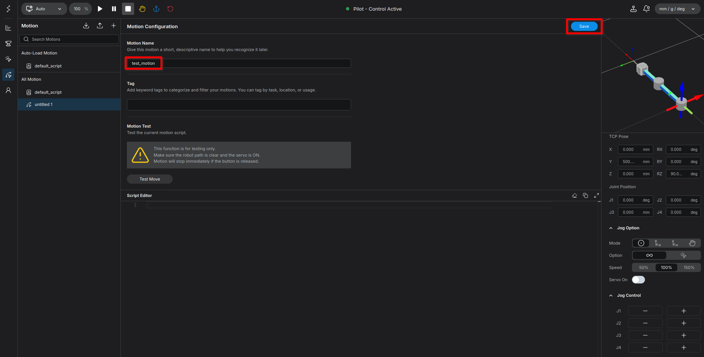
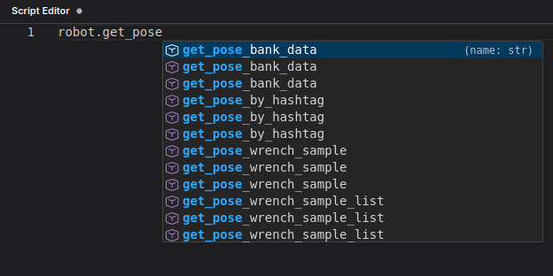
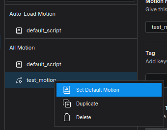
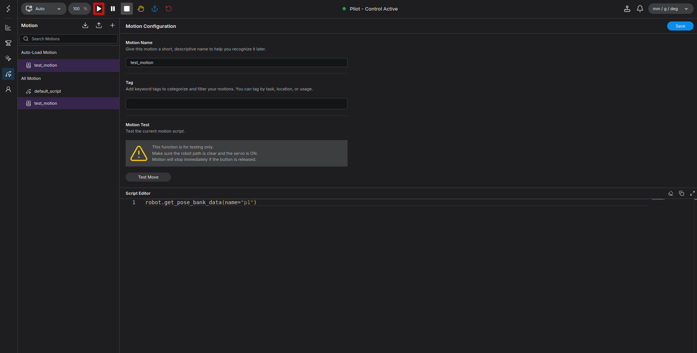
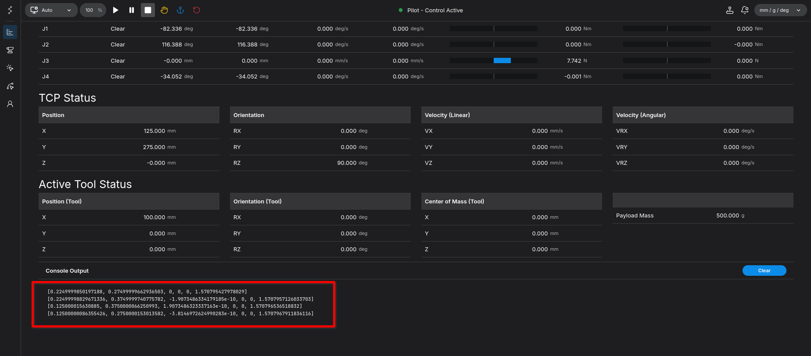
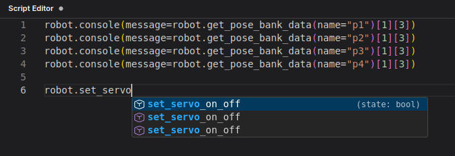

# Executing Programmed Movements - Robot Programming

In this part, we will load the poses we saved in the previous section and write a Python program to move the robot through these points. 

!!! warning "For all methods belonging to the `robot` object in this section, you **must explicitly specify the argument names** (keyword arguments). Positional arguments will not work."

**Goal:** Write a Python script to fetch saved poses, turn on the servo, avoid singularities, and execute precise linear and joint movements.

---

## Setup: Creating a New Motion File

<figure markdown="span">
    
    <figcaption>Clicking the Motion icon and + button</figcaption>
</figure>

1. Click the **Motion** icon on the left side of the screen.
2. Click the **+** button on the right side.
3. A new file named `untitled 1` will be created. This is where we will be writing our code from now on.
4. First, let's rename this file to `test_motion` and click save.

<figure markdown="span">
    
    <figcaption>Renaming the file to test_motion and saving</figcaption>
</figure>

---

## Step 1: Fetching and Verifying Pose Data

First, let's load the poses we saved earlier.

1. In the code editor, start typing `robot.get_pose` and the auto-complete list will appear.
2. Select or complete it to `robot.get_pose_bank_data`.

<figure markdown="span">
    
    <figcaption>Auto-complete suggestions for get_pose</figcaption>
</figure>

3. Write the following code:

```python
robot.get_pose_bank_data(name="p1")
```

4. Click **Save** in the top right corner. The system will perform basic syntax checking and save your code. 

Wait! Before we execute the program, let's set this script as the Default Motion.

<figure markdown="span">
    
    <figcaption>Setting the script as the Default Motion</figcaption>
</figure>

5. Click the **Play** button to run the program. **Notice that nothing happens.**

<figure markdown="span">
    
    <figcaption>Clicking the Play button to execute the script</figcaption>
</figure>

This is because the function was called, but we didn't print its returned value. Let's use the `console` function to view it. Update your code to:

```python
robot.console(message=robot.get_pose_bank_data(name="p1")[1][3])
robot.console(message=robot.get_pose_bank_data(name="p2")[1][3])
robot.console(message=robot.get_pose_bank_data(name="p3")[1][3])
robot.console(message=robot.get_pose_bank_data(name="p4")[1][3])
```


Save and run. On the **Home** screen's **Console Output**, you will see the TCP pose data printed out:

<figure markdown="span">
    
    <figcaption>Viewing output in the Home screen's Console</figcaption>
</figure>

!!! info "The data we actually need is located at index `[1][3]` of the returned list. This is the raw TCP pose data."
---

## Step 2: Setting Up Target Variables

Now, let's assign these extracted poses to variables and define the velocity (`vel`) and acceleration (`acc`) for each movement.

```python
p1 = robot.get_pose_bank_data(name="p1")[1][3]
p2 = robot.get_pose_bank_data(name="p2")[1][3]
p3 = robot.get_pose_bank_data(name="p3")[1][3]
p4 = robot.get_pose_bank_data(name="p4")[1][3]

p1_target = {'pose': p1, 'vel': 0.5, 'acc': 0.5}
p2_target = {'pose': p2, 'vel': 0.5, 'acc': 0.5}
p3_target = {'pose': p3, 'vel': 0.5, 'acc': 0.5}
p4_target = {'pose': p4, 'vel': 0.5, 'acc': 0.5}
```

---

## Step 3: Servo Control and Avoiding Singularity

To move the robot via programming, we must turn the servo on, just like clicking the Servo On button in the Jog tab.

1. Type `robot.set_servo` and press `Tab` to auto-complete.

<figure markdown="span">
    
    <figcaption>Auto-complete for set_servo_on_off</figcaption>
</figure>

2. The auto-completed signature looks like `robot.set_servo_on_off(state: bool)`. Modify it as follows:

```python
robot.set_servo_on_off(state=True)
sleep(1) # Adds a small delay to ensure brakes are fully released
```


Next, to avoid the singularity position (fully stretched arm), we will do an initial joint movement to slightly bend Joint 2 (the elbow).

```python
home_q_target = {'q': [0, 1.57, 0, 0], 'vel': 0.3, 'acc': 0.3}

robot.move_joint(waypoints=[home_q_target])
while robot.check_finish()[1] is False:
    sleep(0.1)
```

---

## Step 4: Basic Linear Movements (Using Sleep)

Let's move the robot through the square using `move_linear`.

1. Type `robot.move_l` and press Enter to auto-complete `robot.move_linear`.
2. The signature will look like `robot.move_linear(waypoints: list, blocking: bool, finish_mode: typing.Literal['FINE', 'ROUGH'])`. 
3. Remove the extra arguments for now and use hardcoded delays (`sleep(3)`) to separate the movements.

### Intermediate Code:
```python
robot.move_linear(waypoints=[p1_target])
sleep(3)
robot.move_linear(waypoints=[p2_target])
sleep(3)
robot.move_linear(waypoints=[p3_target])
sleep(3)
robot.move_linear(waypoints=[p4_target])
sleep(3)
```

If you save and run this, the robot will move to `p1`, pause for 3 seconds, move to `p2`, pause for 3 seconds, and so on. However, using fixed `sleep()` timers is an unreliable workaround. A proper program needs to verify that the robot has actually reached its target.

---

## Step 5: Advanced Logic using check_finish()

To properly check if the robot has arrived, we use `robot.check_finish()`. 

If you auto-complete it, you get `robot.check_finish(finish_mode: typing.Literal['FINE', 'ROUGH'])`. Leaving it empty defaults to `finish_mode='FINE'`.
- **FINE mode:** Checks that the planned trajectory has finished *and* verifies that the actual joint encoder values are within a specific threshold of the target.

When the robot reaches the target, the boolean at index `[1]` becomes `True`.

### Updated Reliable Code:
Replace the `sleep(3)` lines with `while` loops that wait until the movement is finished:

```python
robot.move_linear(waypoints=[p1_target])
while robot.check_finish()[1] is False:
    sleep(0.1)

robot.move_linear(waypoints=[p2_target])
while robot.check_finish()[1] is False:
    sleep(0.1)

robot.move_linear(waypoints=[p3_target])
while robot.check_finish()[1] is False:
    sleep(0.1)

robot.move_linear(waypoints=[p4_target])
while robot.check_finish()[1] is False:
    sleep(0.1)
```
Save and run. The robot will now transition to the next target exactly when it arrives at the current one, without unnecessary delays.

---

## Step 6: Continuous Movement (Combining Waypoints)

Instead of sending distinct commands for each point, you can bundle them into a single command for a smooth, continuous trajectory.

### Final Refined Code:
```python
p1 = robot.get_pose_bank_data(name="p1")[1][3]
p2 = robot.get_pose_bank_data(name="p2")[1][3]
p3 = robot.get_pose_bank_data(name="p3")[1][3]
p4 = robot.get_pose_bank_data(name="p4")[1][3]

p1_target = {'pose': p1, 'vel': 0.5, 'acc': 0.5}
p2_target = {'pose': p2, 'vel': 0.5, 'acc': 0.5}
p3_target = {'pose': p3, 'vel': 0.5, 'acc': 0.5}
p4_target = {'pose': p4, 'vel': 0.5, 'acc': 0.5}

home_q_target = {'q': [0, 1.57, 0, 0], 'vel': 0.3, 'acc': 0.3}

robot.set_servo_on_off(state=True)
sleep(1)

robot.move_joint(waypoints=[home_q_target])
while robot.check_finish()[1] is False:
    sleep(0.1)

robot.move_linear(waypoints=[p1_target, p2_target, p3_target, p4_target])
while robot.check_finish()[1] is False:
    sleep(0.1)
```

!!! idea "**Pro Tip:** When executing multiple waypoints in a single `move_linear` command, you may notice slight circular blending (arc interpolation) as the robot passes through the corners. If you want sharp, complete stops at every point instead, you can specify a `radius` of `0` in your target definitions."

---

## Step 7: Executing Joint Movements (Using move_joint)

In the previous steps, we used `move_linear` to move the TCP in a perfectly straight line between points. However, you can also move the robot by directly driving its specific joint angles to their saved states. This is done using the `move_joint` command.

When we fetched the Cartesian pose data earlier, we used index `[1][3]` (`[x, y, z, rx, ry, rz]`). To get the raw joint angles (`[q1, q2, q3, q4, ...]`), we simply change the index to `[1][4]`.

!!! info "**Concept:** While `move_linear` forces the tool tip to travel in a straight line, `move_joint` calculates the most efficient way for the individual motors to reach their target angles. This often results in a slightly curved, sweeping motion in 3D space, which is typically faster and smoother for the mechanical joints."

### Fetching Joint Data and Setting Targets

Let's extract the joint angles and set up new target dictionaries. Notice that we use the key `'q'` instead of `'pose'`:

```python
# Fetching raw joint angles (index [1][4]) instead of Cartesian poses
q1 = robot.get_pose_bank_data(name="p1")[1][4]
q2 = robot.get_pose_bank_data(name="p2")[1][4]
q3 = robot.get_pose_bank_data(name="p3")[1][4]
q4 = robot.get_pose_bank_data(name="p4")[1][4]

# Defining the targets using the 'q' key
q1_target = {'q': q1, 'vel': 0.5, 'acc': 0.5}
q2_target = {'q': q2, 'vel': 0.5, 'acc': 0.5}
q3_target = {'q': q3, 'vel': 0.5, 'acc': 0.5}
q4_target = {'q': q4, 'vel': 0.5, 'acc': 0.5}
```

### Executing the Sequence

Just like with `move_linear`, you can execute these targets sequentially and use `check_finish()` to ensure the robot has successfully reached each point before issuing the next command:

```python
robot.move_joint(waypoints=[q1_target])
while robot.check_finish()[1] is False:
    sleep(0.1)

robot.move_joint(waypoints=[q2_target])
while robot.check_finish()[1] is False:
    sleep(0.1)

robot.move_joint(waypoints=[q3_target])
while robot.check_finish()[1] is False:
    sleep(0.1)

robot.move_joint(waypoints=[q4_target])
while robot.check_finish()[1] is False:
    sleep(0.1)
```

!!! idea "**Pro Tip:** Exactly like our continuous linear movements, you can also bundle these joint targets into a single command for a smooth, uninterrupted trajectory: "
    `robot.move_joint(waypoints=[q1_target, q2_target, q3_target, q4_target])`
---

## Summary
Congratulations! You have successfully:

1. Created and saved a new motion script.
2. Retrieved saved Cartesian and Joint poses directly via Python code.
3. Programmatically controlled the servo state and handled singularities.
4. Mastered the logic for executing linear sequences (`move_linear`).
5. Learned the difference between arbitrary delays (`sleep`) and robust state-checking (`check_finish`).
6. Understood how to execute sweeping, motor-efficient movements using raw joint angles (`move_joint`).