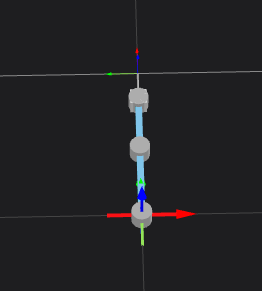
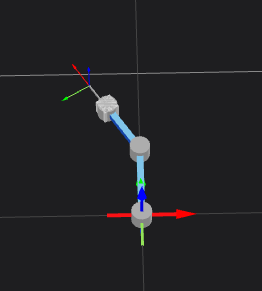
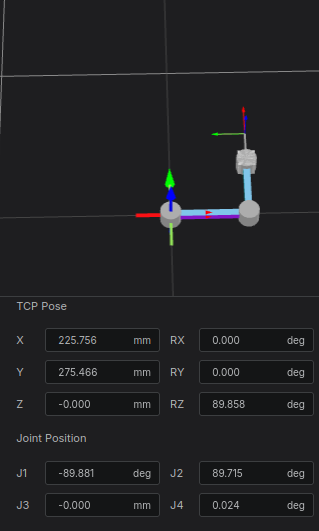
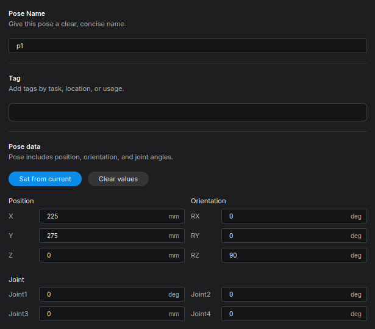
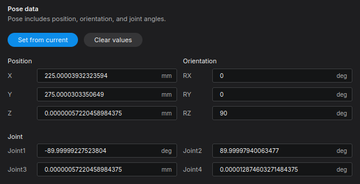

# Teaching and Saving Points - Basic Robot Movements

In this part of the tutorial, we will learn how to specify teaching points and save them so they can be loaded and executed later. 

**Goal:** Use the Jog interface to teach and save a 100mm square path, pairing Cartesian poses with their corresponding joint angles to understand the difference between joint and linear movements in later sections.

---

## Step 1: Pre-requisite - Handling Singularity and Base Coordinates

Before we begin saving poses, let's assume the robot is currently in a fully stretched out (fully extended) state.

<figure markdown="span">
    
    <figcaption>Robot in a fully stretched state</figcaption>
</figure>

If we try to control the TCP based on the Base coordinate system right now, we will encounter a **singularity** (where the robot arms align, causing a loss of degrees of freedom). While avoiding singularities isn't the primary goal of this tutorial, it is a necessary first step.

1. To avoid this, use the Joint Jog to slightly bend **Joint 2 (the elbow)**.
2. Once the arm is slightly bent, select **Base** to control the TCP relative to the Base coordinate system.

<figure markdown="span">
    
    <figcaption>Slightly bending Joint 2 and selecting Base coordinates</figcaption>
</figure>

---

## Step 2: Adding and Teaching the First Pose

Now, let's create our first reference point. 

1. Click the `+` button in the top left corner to add a new pose.
2. Our target for the first point is:
   - **X:** 225mm, **Y:** 275mm, **Z:** 0
   - **RX:** 0, **RY:** 0, **RZ:** 90deg
3. Try using the Jog buttons to get the robot's TCP as close to these coordinates as possible.

<figure markdown="span">
    
    <figcaption>Jogging close to the target, resulting in messy decimals</figcaption>
</figure>

In actual field teaching, jogging often results in messy decimal numbers. However, there are many cases where you want exact, clean numbers if a precise posture is required for your task.

---

## Step 3: Direct Input and Test Moves

When you want precise numbers, you can input them directly.

1. Type the exact target coordinates directly into the Position fields on the left.

<figure markdown="span">
    
    <figcaption>Directly inputting clean coordinate numbers</figcaption>
</figure>

2. Without saving, **press and hold** the **Test Move (Linear)** button. The robot will move and cleanly align itself with the exact coordinates you entered. 

!!! info "**Crucial Safety Note**" 
    You must keep the button pressed. If you release it, the robot will stop immediately. This is a critical safety feature in real-world applications to prevent collisions due to interference, allowing you to inch toward the target and verify the path safely.

3. To update the joint angles for this new exact position, click the **Set from current** button. 
4. Click **Save** to lock in the point.

!!! info "Even after clicking `Set from current`, you can still manually adjust the numbers if you wish to round off a specific axis."

### Understanding Test Moves
- **Test Move (Joint):** The robot interpolates movement in the *Joint Space*, moving from its current joint angles to the target joint angles. The TCP path may be curved.
- **Test Move (Linear):** The robot interpolates movement in the *Task Space*, moving the TCP in a straight line from the current position to the target.

<figure markdown="span">
    
    <figcaption>Applying 'Set from current' after the Test Move</figcaption>
</figure>

---

## Step 4: Creating a Square Path

Now, let's create the remaining three points using the direct input method to complete a 100mm square pattern.

Repeat the process (Input -> Press & Hold Move -> Set from current -> Save) for the following three points:

* **Point 2:** X=225mm, Y=375mm, Z=0, RX=0, RY=0, RZ=90deg
* **Point 3:** X=125mm, Y=375mm, Z=0, RX=0, RY=0, RZ=90deg
* **Point 4:** X=125mm, Y=275mm, Z=0, RX=0, RY=0, RZ=90deg

!!! info "**Why are we saving Joint Angles for a Linear move?** "
    * Strictly speaking, if you only plan to execute a linear motion (`move_linear`), you don't necessarily need to physically move the robot there to extract the joint angles, as linear moves rely purely on the Cartesian pose target. 

    * However, in this tutorial, we are intentionally pairing the target pose with its corresponding joint angles. Saving both as a pair will allow us to clearly observe the difference between Joint movement and Linear movement when we write the motion program in the next tutorial.

Once all four points are saved, click **Test Move (Linear)** for points 1 through 4 in sequence. You will see the robot's TCP moving in perfect straight lines, drawing a 100mm square.

---

## Summary
Congratulations! You have successfully:

1. Prepared the robot by moving it out of a kinematic singularity.
2. Learned how to manually input precise coordinates and safely use the "Press and Hold" Test Move feature.
3. Paired exact Cartesian poses with joint values using `Set from current`.
4. Created and verified a sequence of points forming a square path.

Proceed to the [next chapter](../motion/index.md) to write a motion program and execute these saved poses.