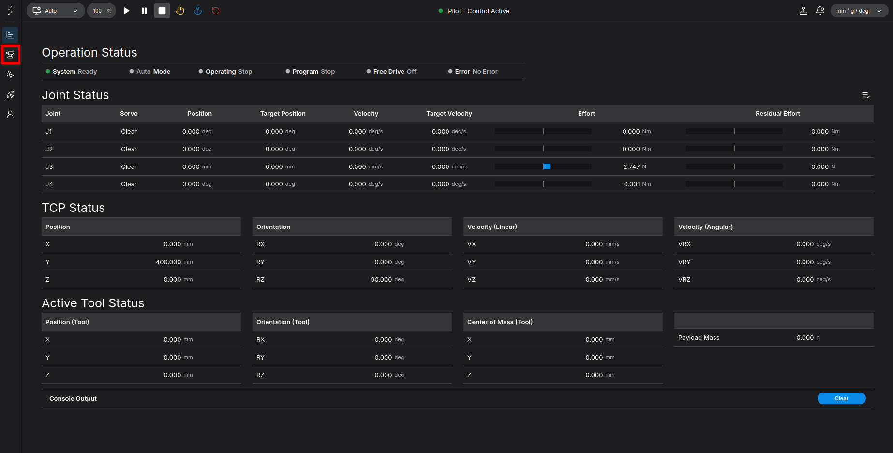
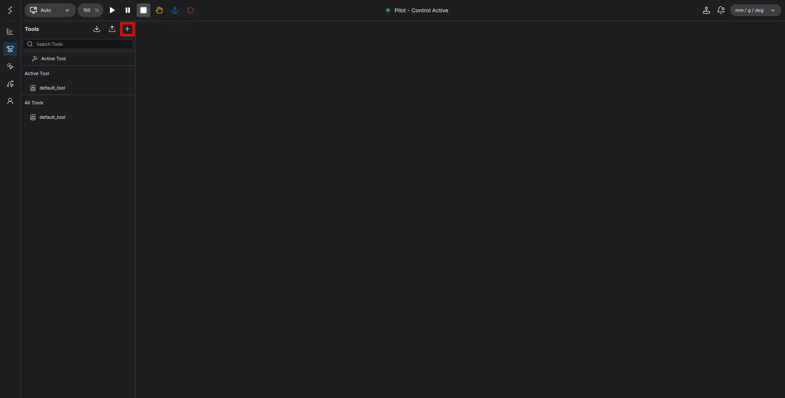
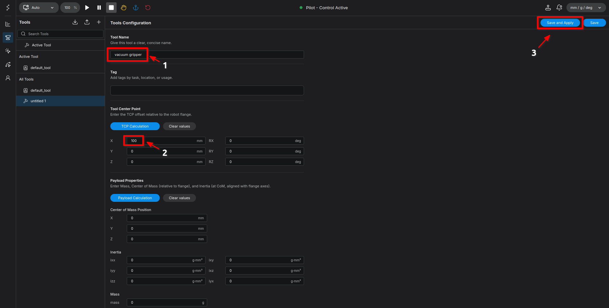
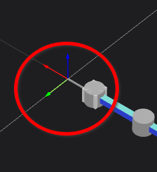
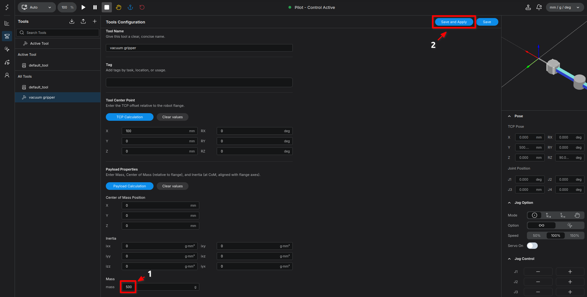
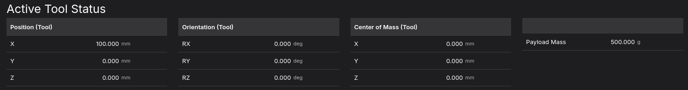
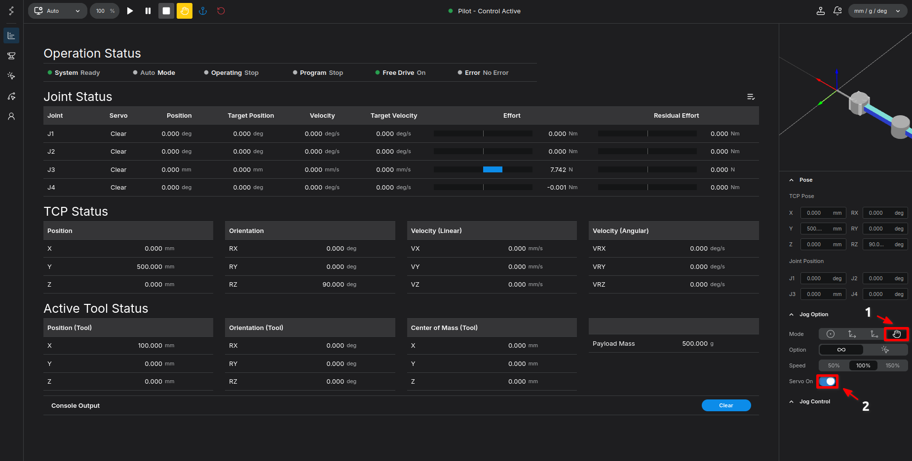
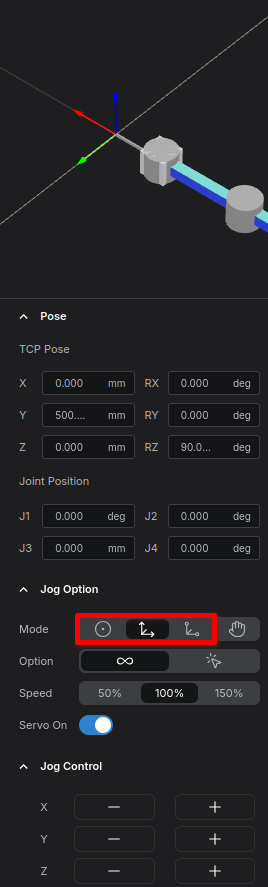

# Setting Up Tool and Payload - Tool Configuration

Before starting robot teaching, we first need to specify the tool we will use. In this tutorial, we will walk through the process of setting up a new tool, configuring its Tool Center Point (TCP) offset, and defining the payload for accurate gravity compensation.

**Goal:** Create a tool named `vacuum gripper`, configure a 100mm TCP offset, and set a 500g payload.

---

## Step 1: Open the Tool Tab

1. Navigate to the **Home** screen.
2. Click the **Tool** icon (drill shape) on the left tab.

<figure markdown="span">
    
    <figcaption>Click the <strong>Tool</strong> icon on the Home screen</figcaption>
</figure>

3. Once the Tool tab appears, click the `+` button to add a new tool.

<figure markdown="span">
    
    <figcaption>Click the <strong>+</strong> button to add a tool</figcaption>
</figure>

---

## Step 2: Configure Tool Name and TCP Offset

Now we will name the tool and set its offset relative to the robot's flange.

1. In the right tab, enter `vacuum gripper` for the **Tool Name**. (You can name this freely based on your application, but we will use this for the tutorial).
2. Under the **Tool Center Point** section, enter the offset values.
    - To simulate a gripper extending 100mm forward, enter `100` in the **X** axis. 
    - This creates a new TCP offset from the tool flange coordinate system.

<figure markdown="span">
    { width="1000" }
    <figcaption>Name the tool and set the TCP X offset to 100mm</figcaption>
</figure>

3. Click the **Save and Apply** button in the top right corner. You can verify that the tool configuration has been applied immediately.

<figure markdown="span">
    
    <figcaption>TCP offset applied in the Jog interface</figcaption>
</figure>

---

## Step 3: Configure Payload

Next, we must specify the payload. This value is critical for calculating gravity compensation during free drive (hand-guiding) or position control. You should enter the mass of the actual end-effector as accurately as possible.

1. In the Payload section, enter `500` for the **Mass**.

2. For this tutorial, assume the center of mass and rotational inertia are `0`.

<figure markdown="span">
    { width="1000" }
    <figcaption>Enter 500 in the Mass field</figcaption>
</figure>

3. Click **Save and Apply** in the top right corner to save your settings.

---

## Step 4: Verify the Setup

There are two ways to confirm that your tool and payload settings have been applied correctly: an indirect method and a direct method.

### 1. Indirect Verification (Home Screen)
Navigate back to the **Home** screen and look at the **Active Tool Status**. On the right side of this section, you should see the **Payload Mass** successfully applied as `500g`.

<figure markdown="span">
    
    <figcaption>Verify the 500g Payload in Active Tool Status</figcaption>
</figure>

### 2. Direct Verification (Free Drive)
1. Go to the right **Jog** tab, click **Free Drive**, and turn **Servo On**.
2. Observe the robot's coordinates. You will notice the Z-axis in the Pose section, or Joint 3, slowly rising. 

!!! info "**Why does this happen?** "
    The robot is applying an upward force to compensate for a 500g load. Since there is currently no physical 500g gripper attached to pull it down, the robot drifts upward. If the actual gripper were attached, it would remain perfectly balanced.

<figure markdown="span">
    
    <figcaption>Activating Servo On and Free Drive in the Jog Tab</figcaption>
</figure>

### 3. Disable Free Drive
To stop the robot from rising, you need to exit Free Drive mode. To do this, click on any of the other jog mode buttons (**Axis**, **Base TCP**, or **Tool TCP**). Selecting any mode other than Free Drive will disable it and switch the robot back to standard Position Control.

<figure markdown="span">
    
    <figcaption>Disabling Free Drive mode</figcaption>
</figure>

---

## Summary
Congratulations! You have successfully:

1. Created a new tool and configured its TCP offset.
2. Applied the correct payload parameters for gravity compensation.
3. Verified the setup using both system status and physical free drive checks.

Your tool setup is now complete. In the [next part](../pose/index.md), we will use this configured tool to perform an actual teaching task.